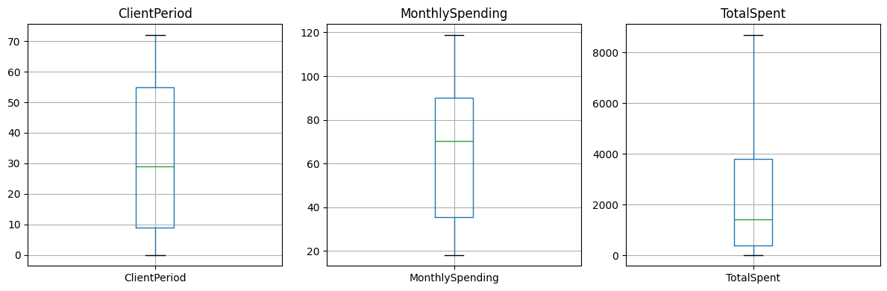
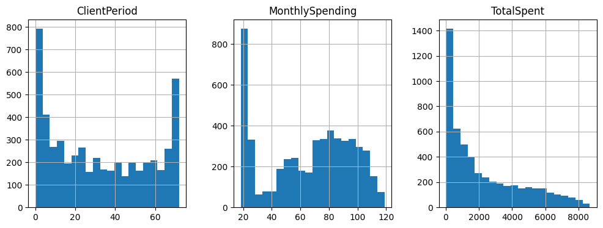
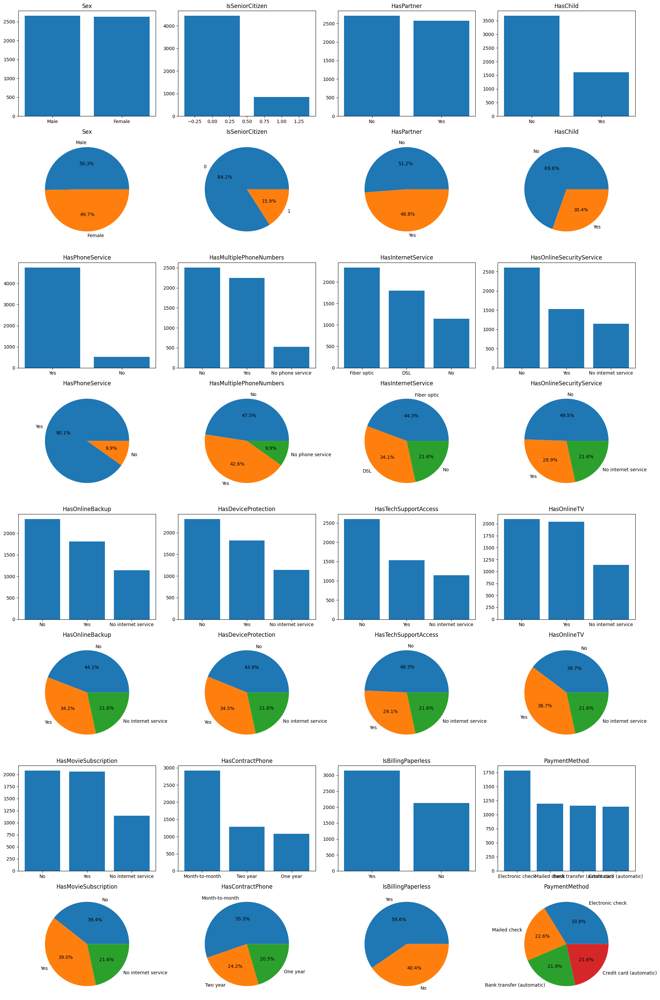
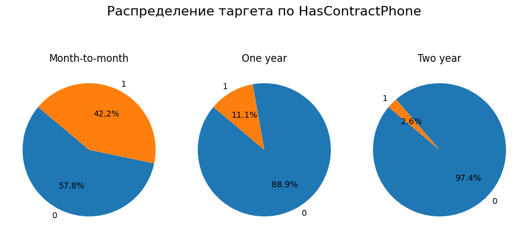
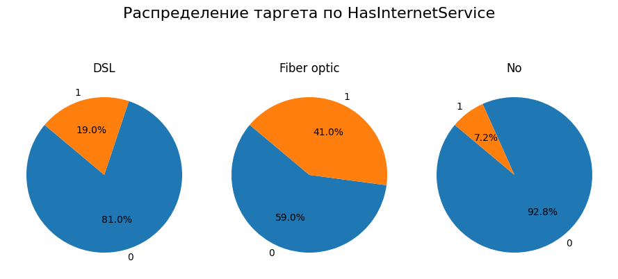

# Customer Churn Prediction

## О проекте

ML-проект по решению задачи бинарной классификации: предсказание оттока клиентов (Customer Churn Prediction).

  

Проект реализован как полноценный end-to-end tabular ML pipeline:

- исследовательский анализ данных (EDA),
- preprocessing и очистка данных,
- работа с категориальными и числовыми признаками,
- обучение baseline-моделей,
- обучение и тюнинг CatBoost,
- кросс-валидация,
- сравнение моделей по ROC-AUC,
- анализ переобучения,
- генерация финальных предсказаний.

---

## Situation

Передо мной стояла задача построить модель, способную предсказывать вероятность ухода клиента.

Особенности задачи:

- смешанные типы признаков (числовые + категориальные),
- необходимость корректной обработки категориальных данных,
- наличие скрытых проблем с типами данных,
- дисбаланс классов,
- метрика качества — ROC-AUC,
- необходимость получить устойчивую модель без сильного переобучения.

Дополнительная цель проекта:
не просто получить высокий score, а построить воспроизводимый ML pipeline с полноценным анализом решений.

---

## Task

Требовалось:

- провести исследовательский анализ данных,
- проверить качество и структуру датасета,
- обработать признаки и исправить проблемы типов данных,
- обучить несколько моделей,
- сравнить линейный подход и boosting,
- подобрать гиперпараметры,
- оценить модели по ROC-AUC,
- проанализировать переобучение,
- подготовить финальные предсказания.

---

## Actions

# 1. Исследование данных (EDA)

Были выполнены:

- анализ структуры датасета,
- проверка типов данных,
- поиск скрытых NaN,
- анализ распределений признаков,
- визуальный анализ категориальных и числовых признаков,
- анализ зависимости churn от категориальных признаков.

Датасет:

- 5282 объектов,
- 20 признаков,
- 16 категориальных признаков,
- 3 числовых признака,
- 1 target column (`Churn`).

## Распределения числовых признаков

  

## Категориальные признаки

  

Особое внимание уделялось:

- скрытым пропускам,
- неверным типам данных,
- дисбалансу классов,
- влиянию contract type и internet service на churn.

---

# 2. Ключевые инсайты из EDA

## Contract type сильно влияет на churn

### Month-to-month
- churn ≈ 42.2%

### One year
- churn ≈ 11.1%

### Two year
- churn ≈ 2.6%

  

Вывод:

Долгосрочные контракты значительно повышают удержание клиентов.

---

## Internet service влияет на churn

### Fiber optic
- churn ≈ 41%

### DSL
- churn ≈ 19%

### No internet
- churn ≈ 7%

Возможная гипотеза:

Пользователи Fiber Optic более чувствительны к цене или качеству сервиса.

  

---

## Financial features

EDA показал:

- клиенты с высоким `MonthlySpending` чаще уходят,
- `TotalSpent` имеет сильную асимметрию распределения,
- у новых клиентов churn выше.

---

# 3. Предобработка данных

В рамках preprocessing pipeline:

- колонка `TotalSpent` преобразована из `object` в числовой тип,
- обработаны NaN,
- числовые признаки масштабированы,
- категориальные признаки закодированы через One-Hot Encoding,
- выполнено разделение train / validation.

Используемые инструменты:

- pandas
- numpy
- scikit-learn

---
# 4. Baseline — Logistic Regression

Была реализована baseline-модель на основе Logistic Regression.

Использовались:

- `LogisticRegressionCV`
- `GridSearchCV`
- ROC-AUC
- cross-validation

---

## LogisticRegressionCV

Подбирался параметр регуляризации `C`.

Тестировались значения:

    [100, 50, 35, 30, 25, 20, 10, 5, 1, 0.5, 0.1, 0.01, 0.001]

Лучший результат:

    C = 30

Метрики:

| Dataset | ROC-AUC |
|---|---|
| Train | 0.8467 |
| Validation | 0.8548 |

---

## Logistic Regression + Pipeline + GridSearchCV

Использовался sklearn Pipeline с preprocessing и model selection.

Лучший параметр:

    C = 10

Метрики:

| Dataset | ROC-AUC |
|---|---|
| Cross-validation | 0.8449 |
| Validation | 0.8546 |

---

## Вывод по линейным моделям

Logistic Regression показала:

- высокий ROC-AUC,
- хорошую обобщающую способность,
- стабильность между train и validation,
- минимальное переобучение.

Это показало, что:

- признаки хорошо разделимы линейно,
- OHE + linear decision boundary достаточно эффективны для данной задачи.

---

# 5. CatBoost

Для улучшения качества был протестирован CatBoostClassifier.

Почему CatBoost:

- хорошо работает с категориальными признаками,
- минимальный preprocessing,
- сильный baseline для tabular ML.

---

## Default CatBoost

Метрики:

| Dataset | ROC-AUC |
|---|---|
| Train | 0.8954 |
| Validation | 0.8267 |

Наблюдение:

Несмотря на высокий train score, модель начала переобучаться.

---

## Hyperparameter tuning

Проводился grid search по параметрам:

- iterations = [300, 500]
- learning_rate = [0.05, 0.1]

Лучшие параметры:

- iterations = 300
- learning_rate = 0.05

Метрики:

| Dataset | ROC-AUC |
|---|---|
| Train | 0.8922 |
| Validation | 0.8258 |

---

## Дополнительный tuning — l2_leaf_reg

Проводился дополнительный подбор регуляризации:

- l2_leaf_reg ∈ [0, 1]

Лучшее значение:

- l2_leaf_reg = 0.8947

Метрики:

| Dataset | ROC-AUC |
|---|---|
| Train | 0.8958 |
| Validation | 0.8230 |

---

# 6. Сравнение моделей

| Model | Train ROC-AUC | Validation ROC-AUC |
|---|---|---|
| LogisticRegressionCV | 0.8467 | 0.8548 |
| LogisticRegression + Pipeline | — | 0.8546 |
| Default CatBoost | 0.8954 | 0.8267 |
| Tuned CatBoost | 0.8922 | 0.8258 |
| Tuned CatBoost + l2 | 0.8958 | 0.8230 |

---

# 7. Главный ML-вывод проекта

Несмотря на более сложную архитектуру, CatBoost уступил Logistic Regression на validation.

Причины:

- dataset относительно небольшой,
- признаки хорошо разделимы линейно,
- One-Hot Encoding оказался эффективным,
- boosting начал переобучаться.

Это показало важный ML-инсайт:

Более сложная модель не всегда означает лучшее качество на unseen data.

---

## Почему использовался ROC-AUC

Метрика ROC-AUC была выбрана потому что:

- задача содержит дисбаланс классов,
- важно оценивать качество ранжирования вероятностей,
- accuracy недостаточно информативна для churn prediction.

---

## Result

В результате был построен полноценный reproducible ML pipeline для задачи churn prediction.

Ключевые результаты:

- проведен полноценный EDA,
- реализован preprocessing pipeline,
- построены baseline и boosting-модели,
- выполнен hyperparameter tuning,
- достигнут ROC-AUC ≈ 0.855,
- проведен анализ переобучения,
- подготовлены финальные предсказания.

## Стек технологий

### ML / DS

- Python
- pandas
- numpy
- scikit-learn
- catboost
- matplotlib
- seaborn

### Метрики

- ROC-AUC

## Структура проекта

project/
│
├── data/
│   ├── train.csv
│   ├── test.csv
│
├── notebooks/
│   └── hw_3_kaggle_stepik_final_version.ipynb
│
├── src/
│   ├── preprocessing.py
│   ├── train_linear.py
│   ├── train_catboost.py
│   ├── inference.py
│   └── metrics.py
│
├── assets/
│   ├── churn_by_contract.png
│   ├── churn_by_internet.png
│   ├── numeric_distributions.png
│   └── cat_features_overview.png
│
├── requirements.txt
└── README.md

## Что можно улучшить дальше

### ML improvements

- feature engineering,
- target encoding,
- Optuna tuning,
- LightGBM / XGBoost,
- ensemble methods,
- probability calibration,
- SHAP analysis.

### Engineering improvements

- sklearn Pipeline,
- конфигурационные файлы,
- logging,
- сохранение моделей через joblib,
- package structure,
- автоматизация inference pipeline.

## Что показывает этот проект

### Проект демонстрирует:

- end-to-end ML workflow,
- EDA и feature analysis,
- preprocessing pipeline,
- работу с табличными данными,
- cross-validation,
- hyperparameter tuning,
- сравнение baseline vs boosting,
- анализ переобучения,
- понимание бизнес-метрик churn,
- reproducible ML-подход.