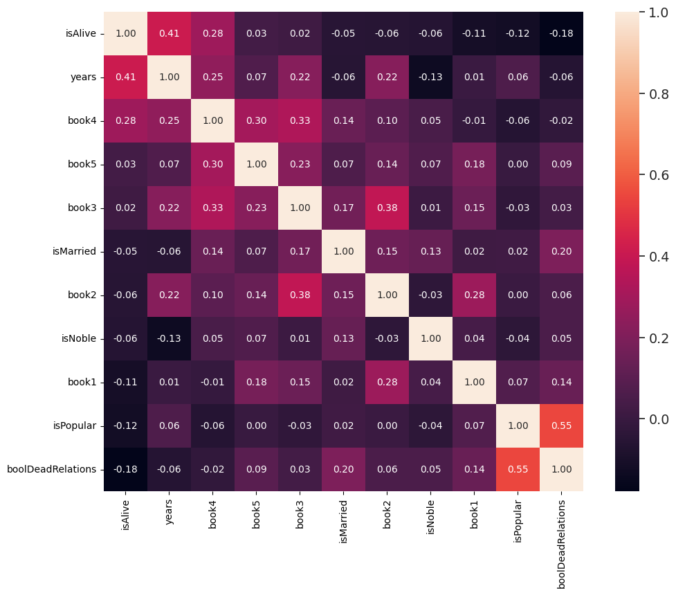
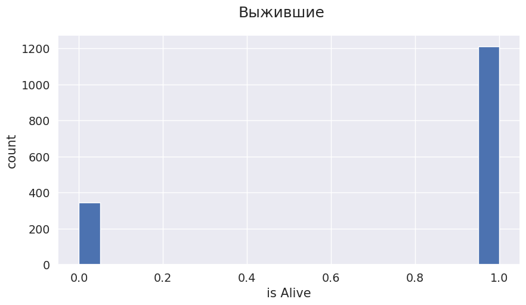
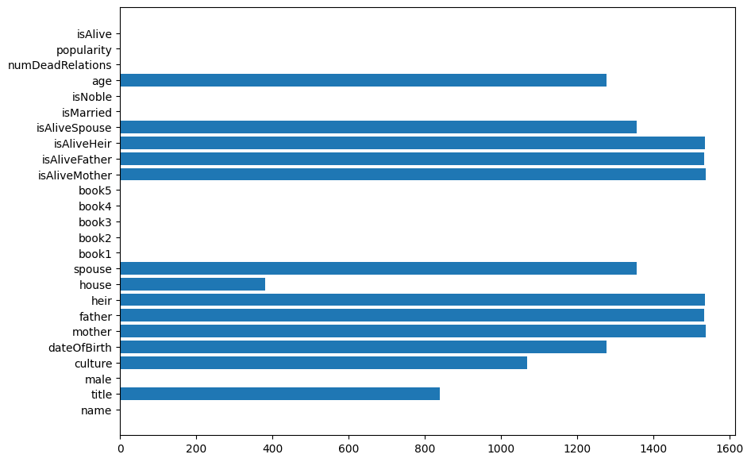
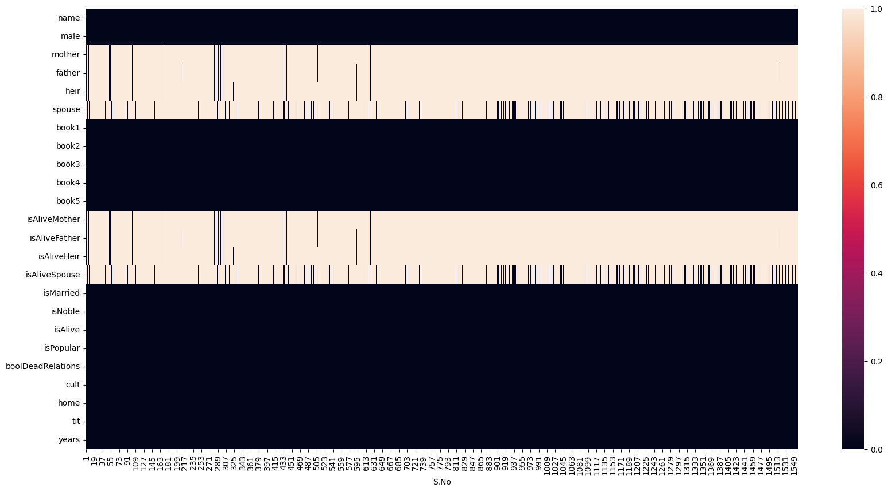
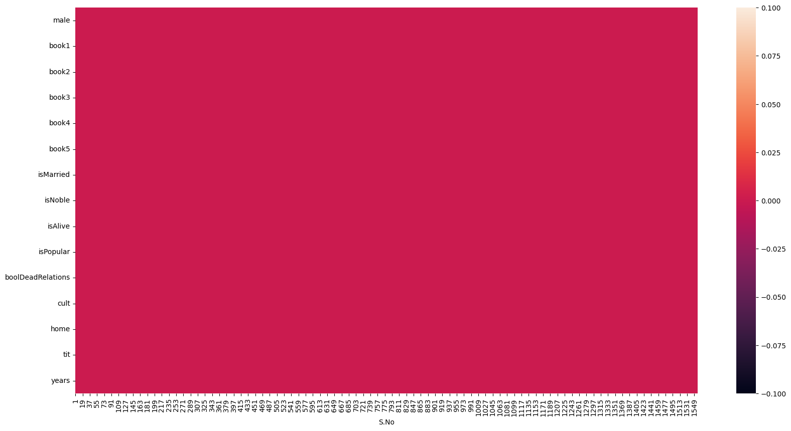

# Game of Thrones Survival Prediction — sklearn Classification



---

## О проекте

Проект посвящён задаче бинарной классификации на табличных данных из вселенной *Game of Thrones*.

Цель — предсказать, выживет ли персонаж (`isAlive`) на основе:

- происхождения;
- дома;
- культуры;
- семейных связей;
- популярности;
- участия в книгах;
- социальных признаков.

---

## Key Highlights

- Binary classification on tabular data
- Extensive feature engineering
- High-cardinality categorical handling
- GridSearchCV hyperparameter tuning
- Comparison of 8 sklearn models
- Best holdout accuracy: **0.8558**
- Refactoring notebook into modular ML pipeline

---

# Что здесь происходит

На примере этого проекта можно увидеть реализацию:

- работы с tabular ML;
- feature engineering;
- обработки категориальных признаков;
- работы с пропусками;
- сравнения ML-моделей;
- hyperparameter tuning;
- построения reproducible ML pipeline.

---

# STAR Summary

## Situation

Исходный датасет содержал:

- большое количество пропусков;
- категориальные признаки высокой кардинальности;
- разреженные genealogical-признаки;
- неоднородные текстовые данные.

Особенно проблемными были:

- `culture`
- `title`
- `house`
- `mother/father/heir/spouse`

Многие признаки имели более 50–80% пропусков.

---

## Task

Необходимо было:

- провести EDA;
- обработать NaN;
- выполнить feature engineering;
- подготовить данные для sklearn-моделей;
- обучить и сравнить несколько алгоритмов классификации;
- выбрать лучшую модель;
- сформировать итоговый `submission.csv`.

---

## Action

В проекте был реализован полный ML pipeline:

### Exploratory Data Analysis (EDA)

- анализ распределений;
- исследование пропусков;
- анализ корреляций;
- визуализация survival distribution.

### Data Cleaning & Feature Engineering

- обработка NaN;
- объединение редких категорий;
- очистка noisy категориальных данных;
- создание новых признаков;
- генерация:
  - `isPopular`
  - `boolDeadRelations`
  - `years`

### Encoding

Для категориальных признаков использовался `OneHotEncoder`.

### Model Training

Были протестированы:

- Logistic Regression
- Random Forest
- AdaBoost
- Gaussian Process
- Gaussian Naive Bayes
- KNN
- SVC
- Decision Tree

### Hyperparameter Tuning

Для моделей использовался `GridSearchCV` с cross-validation.

---

## Result

Лучший результат показала модель:

# KNeighborsClassifier

| Metric | Value |
|---|---|
| Best CV Accuracy | 0.8369 |
| Holdout Accuracy | **0.8558** |

Лучшие параметры:

```python
{
    'n_neighbors': 21,
    'p': 1,
    'weights': 'distance'
}
```

Несмотря на более низкий CV score, KNN показал лучший результат на holdout-выборке.

Вероятно, после feature engineering локальная структура признакового пространства оказалась хорошо разделимой для distance-based методов.

---

# Dataset Overview

## Размер датасета

- 1557 объектов
- 25 признаков

---

# Main Challenges

Основные сложности проекта:

- 80% missing values в `age`
- high-cardinality категориальные признаки
- sparse genealogical features
- noisy text categories
- большое количество NaN
- необходимость feature engineering поверх неполных данных

---

# Missing Values Analysis

## Train dataset

| Feature | Missing |
|---|---|
| title | 53.95% |
| house | 24.47% |
| culture | 68.66% |
| age | 82.08% |

## Test dataset

| Feature | Missing |
|---|---|
| title | 43.19% |
| house | 11.83% |
| culture | 51.41% |
| age | 60.41% |

---

# Визуализации

## Target Distribution



---

## Missing Values Analysis



---

## Heatmap Before Feature Engineering



---

## Heatmap After Feature Engineering



---

## Correlation Matrix


---

# Feature Engineering

Основной акцент проекта был сделан именно на работе с признаками.

Были реализованы:

- очистка категориальных данных;
- объединение редких культур;
- обработка NaN;
- создание бинарных признаков;
- извлечение информации из текстовых признаков;
- генерация признаков на основе семейных связей.

---

## Созданные признаки

| Feature | Description |
|---|---|
| isPopular | Популярность персонажа |
| boolDeadRelations | Есть ли мёртвые родственники |
| years | Возраст / дата рождения |

---

# Model Comparison

| Model | Best CV Accuracy | Holdout Accuracy |
|---|---|---|
| Logistic Regression | 0.8506 | 0.8397 |
| Random Forest | 0.8506 | 0.8494 |
| AdaBoost | 0.8554 | 0.8429 |
| Gaussian Process | 0.8490 | 0.8429 |
| GaussianNB | 0.8209 | 0.8333 |
| KNN | 0.8369 | **0.8558** |
| SVC | 0.8522 | 0.8462 |
| Decision Tree | 0.8530 | 0.8397 |

---

# Best Hyperparameters

## KNN

```python
{
    'n_neighbors': 21,
    'p': 1,
    'weights': 'distance'
}
```

## Random Forest

```python
{
    'max_depth': 10,
    'max_features': 'sqrt',
    'min_samples_split': 2,
    'n_estimators': 100
}
```

## AdaBoost

```python
{
    'estimator__max_depth': 2,
    'learning_rate': 1.0,
    'n_estimators': 200
}
```

---

# Что показывает проект

Проект демонстрирует:

- полный workflow tabular ML-задачи;
- работу с пропусками;
- feature engineering;
- обработку high-cardinality категорий;
- сравнение sklearn-моделей;
- hyperparameter tuning;
- reproducible ML pipeline.

---

# Repository Evolution

Проект начинался как exploratory notebook, но позже был переработан в modular ML pipeline с разделением:

- preprocessing;
- feature engineering;
- model training;
- evaluation;
- hyperparameter tuning.

---

# Структура проекта

```text
project/
│
├── data/
│   ├── train.csv
│   ├── test.csv
│   └── submission.csv
│
├── src/
│   ├── data_loading.py
│   ├── preprocessing.py
│   ├── models.py
│   ├── grid_search.py
│   ├── evaluate.py
│   └── train.py
│
├── reports/
│   └── grid_search_results.csv
│
├── images/
│   ├── target_distribution.png
│   ├── nan_analysis.png
│   ├── heatmap_before.png
│   ├── heatmap_after.png
│   └── correlation_matrix.png
│
├── README.md
├── requirements.txt
└── .gitignore
```

---

# Как запустить

## Установка зависимостей

```bash
pip install -r requirements.txt
```

---

## Запуск обучения

```bash
python src/train.py
```

---

# Технологии

- Python
- pandas
- NumPy
- matplotlib
- seaborn
- scikit-learn

---

# Возможные улучшения

Что можно улучшить дальше:

- добавить sklearn Pipeline;
- использовать CatBoost / XGBoost;
- добавить calibration analysis;
- провести feature importance analysis;
- попробовать target encoding;
- реализовать stacking/blending моделей.

---

# Контакты

GitHub: https://github.com/MataNerdy
