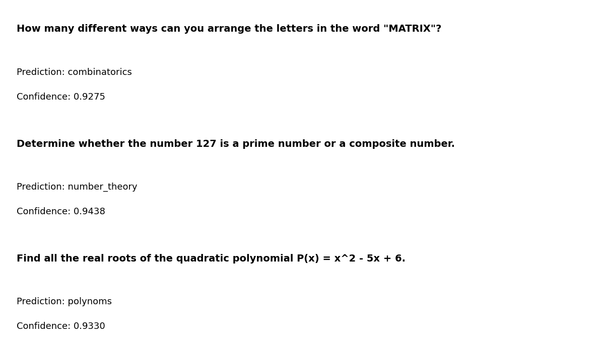
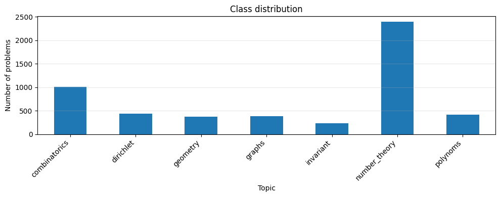
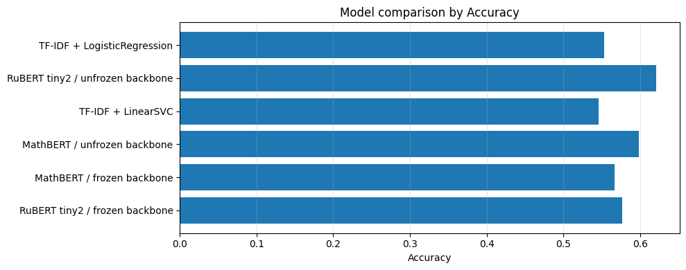
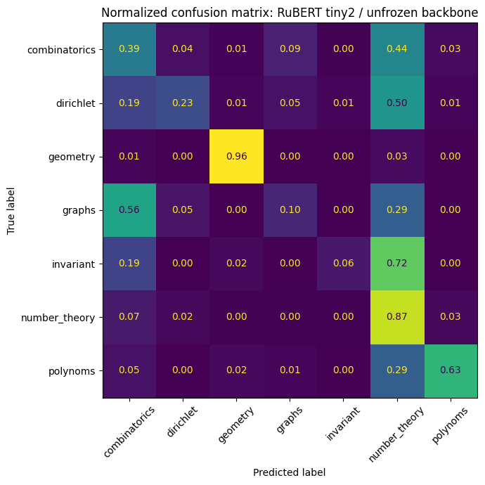
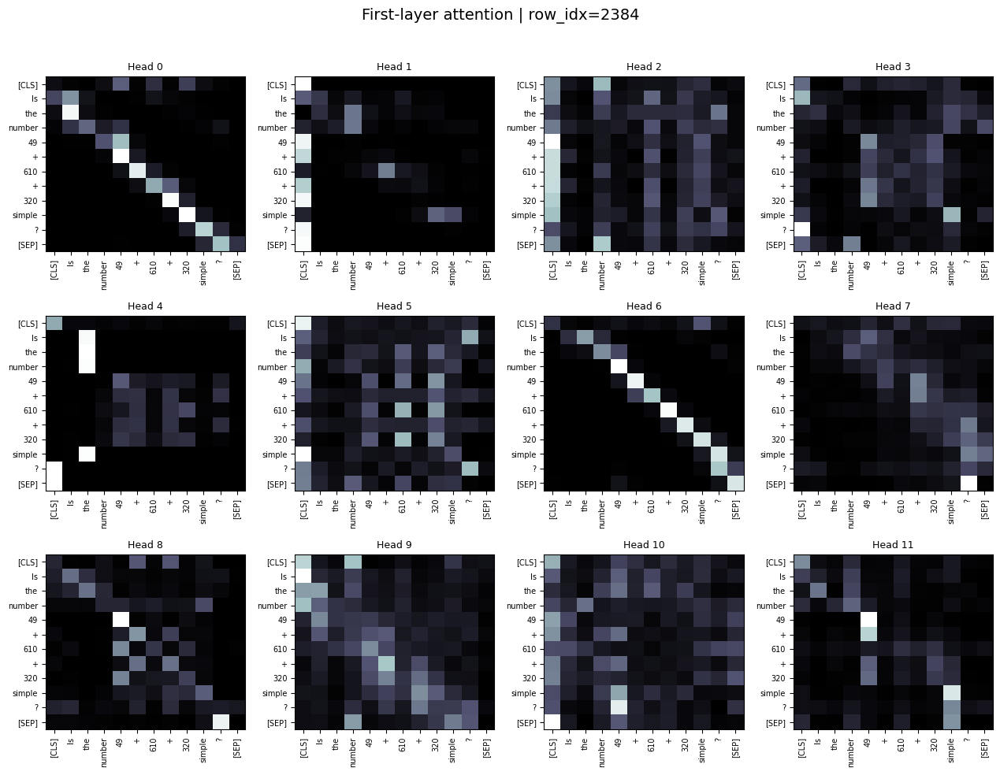

# Math Problem Topic Classification with RuBERT and MathBERT

Проект посвящён классификации текстов математических задач по тематическим разделам.
Цель — сравнить классические NLP baseline-модели и transformer-based подходы на небольшом специализированном датасете математических формулировок.


**Пример работы модели**

Модель получает текст математической задачи и возвращает наиболее вероятную тему.

<p align="left">
  
</p>

## Кратко

В проекте решается задача многоклассовой классификации математических задач по 7 темам:

- `combinatorics`
- `dirichlet`
- `geometry`
- `graphs`
- `invariant`
- `number_theory`
- `polynoms`

### Class distribution



Были протестированы:

- TF-IDF + Logistic Regression
- TF-IDF + Linear SVM
- RuBERT tiny2 с замороженным backbone
- RuBERT tiny2 с размороженным backbone
- MathBERT с замороженным backbone
- MathBERT с размороженным backbone

Лучший transformer-результат:

| Model | Accuracy | Macro F1 | Weighted F1 |
|---|---:|---:|---:|
| RuBERT tiny2 / unfrozen backbone | 0.6206 | 0.4758 | 0.5822 |

Сильный классический baseline:

| Model | Accuracy |
|---|---:|
| TF-IDF + Logistic Regression | ~0.553 |
| TF-IDF + LinearSVC | ~0.546 |





Основной вывод: на небольшом и несбалансированном датасете математических текстов классические TF-IDF модели остаются сильным baseline, а transformer fine-tuning улучшает accuracy, но требует аккуратного анализа качества по классам.

---

## STAR

### Situation

Математические задачи часто хранятся в виде неструктурированных текстов.
Для образовательных платформ, банков задач и рекомендательных систем полезно автоматически определять тему задачи: комбинаторика, геометрия, теория чисел, графы и т.д.

Такая классификация может использоваться для:

- автоматической тематической разметки задач;
- поиска похожих задач;
- построения рекомендательной системы для ученика;
- анализа пробелов по темам;
- подготовки датасетов для последующих NLP/LLM моделей.

### Task

Построить модель, которая по тексту математической задачи предсказывает один из 7 тематических классов.

Дополнительные цели:

- сравнить classical ML и transformer-based подходы;
- проверить влияние заморозки backbone;
- сравнить general-purpose RuBERT и domain-oriented MathBERT;
- провести error analysis;
- визуализировать attention-карты для интерпретации поведения модели.

### Action

В проекте реализован полный пайплайн:

1. Загрузка и очистка данных:
   - удаление пропусков;
   - удаление дубликатов;
   - stratified train/test split.

2. Baseline-модели:
   - TF-IDF vectorization;
   - Logistic Regression;
   - LinearSVC.

3. Transformer-модели:
   - кастомный PyTorch-класс `TransformerClassificationModel`;
   - поддержка HuggingFace backbone;
   - classification head поверх CLS/pooler representation;
   - обучение с frozen и unfrozen backbone;
   - mixed precision training;
   - early stopping;
   - сохранение лучшей модели.

4. Оценка:
   - accuracy;
   - precision / recall / F1 по каждому классу;
   - macro F1;
   - weighted F1;
   - confusion matrix.

5. Интерпретация:
   - attention maps первого слоя;
   - сравнение attention до и после fine-tuning;
   - анализ наиболее частых ошибок.

### Result

Лучший результат среди transformer-моделей показал `cointegrated/rubert-tiny2` с размороженным backbone:

```text
Accuracy:    0.6206
Macro F1:    0.4758
Weighted F1: 0.5822
```

Classification report для лучшей модели:

```text
               precision    recall  f1-score   support

combinatorics     0.4247    0.3911    0.4072       202
    dirichlet     0.4878    0.2273    0.3101        88
     geometry     0.8987    0.9595    0.9281        74
       graphs     0.2424    0.1039    0.1455        77
    invariant     0.4286    0.0638    0.1111        47
number_theory     0.6614    0.8745    0.7532       478
     polynoms     0.7324    0.6265    0.6753        83

     accuracy                         0.6206      1049
    macro avg     0.5537    0.4638    0.4758      1049
 weighted avg     0.5824    0.6206    0.5822      1049
```

Наиболее частые ошибки:

| True class | Predicted class | Count |
|---|---:|---:|
| combinatorics | number_theory | 88 |
| dirichlet | number_theory | 44 |
| graphs | combinatorics | 43 |
| invariant | number_theory | 34 |
| number_theory | combinatorics | 33 |
| polynoms | number_theory | 24 |
| graphs | number_theory | 22 |

Главная проблема модели — смещение в сторону самого частого класса `number_theory`.
Лучше всего модель распознаёт `geometry`, `number_theory` и `polynoms`; хуже всего — `graphs` и `invariant`.

### Example 1

**Input**

> How many ways are there to choose 3 students from a group of 10?

| Topic | Probability |
|---|---:|
| `combinatorics` | 0.9009 |
| `graphs` | 0.0297 |
| `dirichlet` | 0.0295 |

---

### Example 2

**Input**

> Prove that the sum of the angles of a triangle is 180 degrees.

| Topic | Probability |
|---|---:|
| `dirichlet` | 0.3866 |
| `geometry` | 0.2636 |
| `number_theory` | 0.1826 |

---

### Example 3

**Input**

> Find all integers n such that n² + n + 1 is divisible by 7.

| Topic | Probability |
|---|---:|
| `number_theory` | 0.9038 |
| `polynoms` | 0.0503 |
| `combinatorics` | 0.0350 |


### Confusion matrix



---

## Project structure

```text
math_problem_topic_classification/
├── README.md
├── requirements.txt
├── configs/
│   └── train_config.yaml
├── notebooks/
│   └── berts_math_problems_final.ipynb
├── src/
│   ├── data.py
│   ├── dataset.py
│   ├── model.py
│   ├── train_transformer.py
│   ├── train_baselines.py
│   ├── evaluate.py
│   ├── attention_viz.py
│   ├── predict.py
│   └── utils.py
├── assets/
│   └── *.png
└── reports/
    └── README.md
```

---

## Installation

```bash
git clone https://github.com/<your-username>/math-problem-topic-classification.git
cd math-problem-topic-classification

python -m venv .venv
source .venv/bin/activate      # Linux / macOS
# .venv\Scripts\activate       # Windows

pip install -r requirements.txt
```

---

## Usage

### Train classical baselines

```bash
python -m src.train_baselines \
  --output-dir reports/baselines
```

### Train transformer

```bash
python -m src.train_transformer \
  --model-name cointegrated/rubert-tiny2 \
  --epochs 20 \
  --batch-size 32 \
  --max-length 256 \
  --unfreeze-backbone \
  --output-dir checkpoints/rubert_tiny2_unfrozen
```

Для MathBERT:

```bash
python -m src.train_transformer \
  --model-name tbs17/MathBERT \
  --epochs 20 \
  --batch-size 32 \
  --max-length 256 \
  --unfreeze-backbone \
  --output-dir checkpoints/mathbert_unfrozen
```

### Evaluate a saved transformer

```bash
python -m src.evaluate \
  --checkpoint checkpoints/rubert_tiny2_unfrozen/best_model.pt \
  --model-name cointegrated/rubert-tiny2 \
  --output-dir reports/rubert_tiny2_unfrozen
```

### Predict topic for one problem

```bash
python -m src.predict \
  --checkpoint checkpoints/rubert_tiny2_unfrozen/best_model.pt \
  --model-name cointegrated/rubert-tiny2 \
  --text "Prove that among any n+1 integers there are two with the same remainder modulo n."
```

---

### Attention maps

Пример attention-визуализации первого слоя transformer-модели:



Attention-карты использовались не как строгая причинная интерпретация, а как диагностический инструмент: они помогают увидеть, какие токены и локальные связи модель выделяет до и после fine-tuning.

---

## Key findings

1. **TF-IDF baseline оказался неожиданно сильным.**
   Для небольшого специализированного датасета простые лексические признаки хорошо ловят тематические маркеры.

2. **Fine-tuned RuBERT улучшил accuracy, но не решил проблему дисбаланса.**
   Модель часто перекидывает сложные классы в `number_theory`.

3. **Geometry распознаётся лучше всего.**
   У геометрических задач более устойчивый словарь: triangle, circle, angle, quadrilateral, bisector и т.д.

4. **Graphs и invariant — самые проблемные классы.**
   Вероятные причины: меньше данных, пересечение терминов с комбинаторикой и теорией чисел, слабые поверхностные маркеры.

5. **MathBERT не дал явного преимущества.**
   Возможная причина — mismatch между языком/стилем датасета и pretraining-domain модели, а также небольшой объём данных.

---

## Limitations

- Датасет небольшой и несбалансированный.
- Часть текстов содержит машинный перевод / шумную формулировку.
- Оценка проводилась на одном stratified split.
- Attention maps не являются полноценным объяснением модели.
- Для production-сценария нужны cross-validation, calibration и более строгий контроль leakage.

---

## Next steps

- Добавить class weights или focal loss.
- Провести k-fold cross-validation.
- Улучшить preprocessing математических обозначений.
- Протестировать multilingual/e5/sentence-transformer embeddings.
- Сделать retrieval-based baseline.
- Добавить zero-shot / few-shot LLM baseline.
- Использовать hierarchical classification: сначала крупный раздел, затем подтип.
- Собрать Streamlit demo для интерактивной классификации задач.

---

## Tech stack

- Python
- PyTorch
- HuggingFace Transformers
- scikit-learn
- pandas
- NumPy
- matplotlib
- seaborn
- tqdm

---

## Portfolio summary

Проект демонстрирует:

- построение NLP pipeline от данных до анализа ошибок;
- сравнение classical ML и transformer-based моделей;
- работу с HuggingFace и PyTorch;
- fine-tuning transformer-моделей;
- диагностику качества по классам;
- интерпретацию через attention visualization;
- честную оценку ограничений модели.
