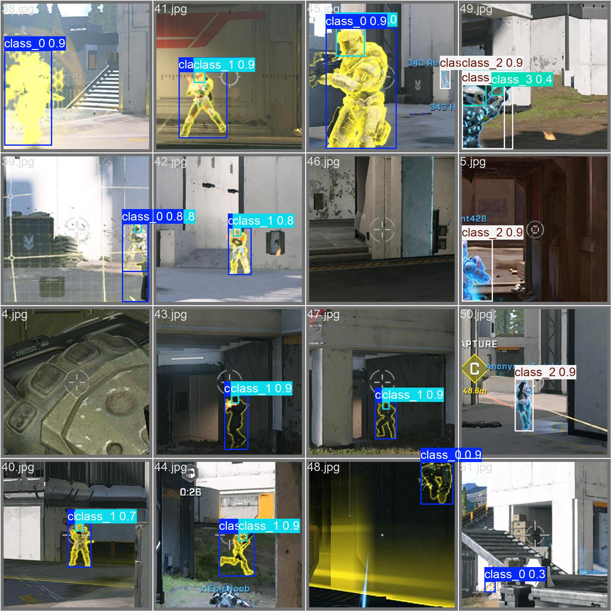
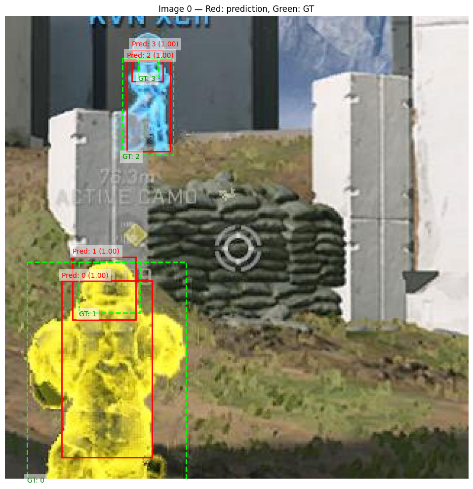
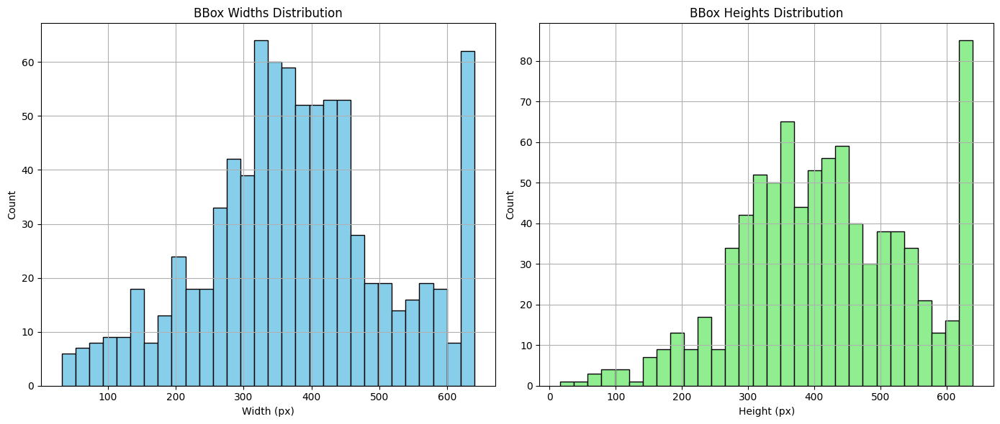
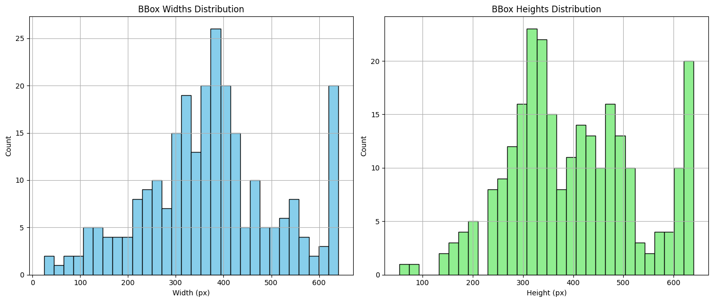
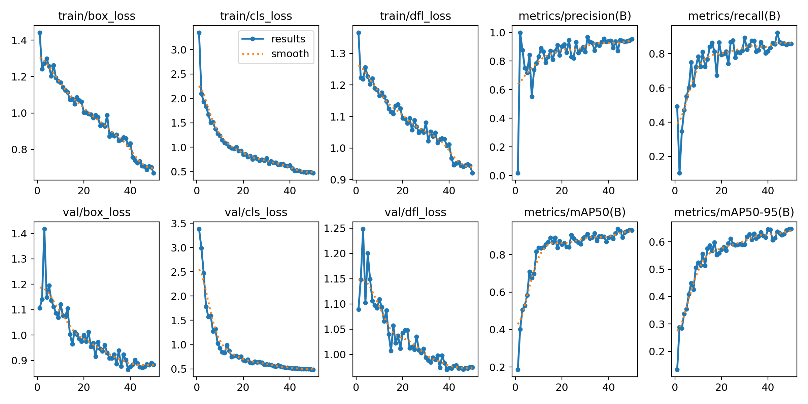
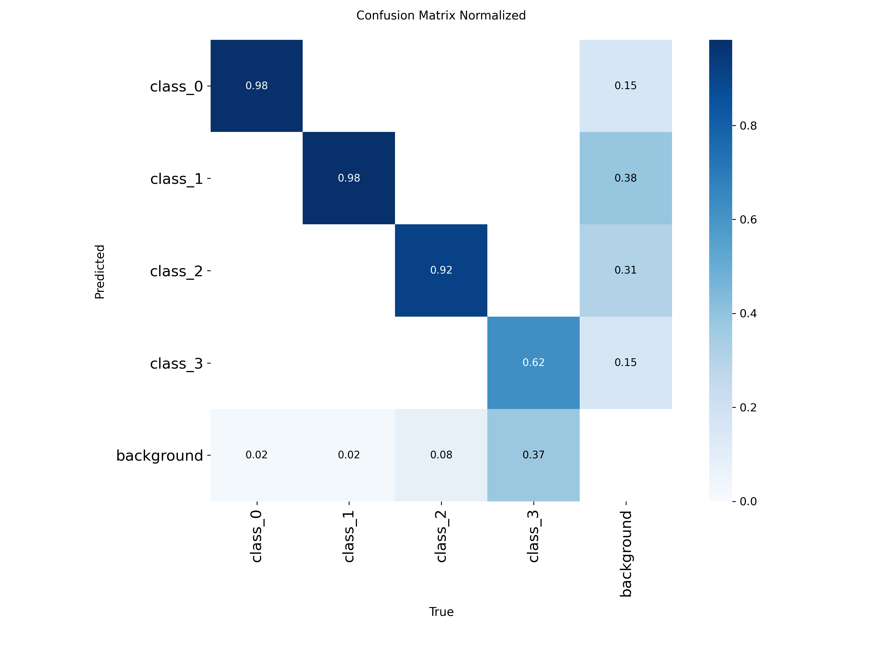

# Halo Infinite Object Detection

Modern object detection pipeline for the Halo Infinite Vision Dataset.

PyTorch-проект по построению и улучшению object detection pipeline:
- custom PyTorch detector;
- EfficientNet backbone;
- FPN / PAN neck;
- confidence-free detection head;
- TAL label assignment;
- DIoU loss;
- YOLOv8 baseline.
---

# Preview

## YOLOv8 Predictions

<p align="center">
  
</p>

---

## Custom Detector Predictions

### GT vs Prediction

Красный — prediction
Зеленый — ground truth

<p align="center">
  
</p>

---

# Situation

Базовый detector из семинаров обладал рядом ограничений:

- слабая работа с multi-scale объектами;
- простая detection head;
- базовый label assignment;
- poor localization quality;
- нестабильное обучение bbox regression.

Цель проекта — построить более современный object detection pipeline и исследовать влияние различных улучшений:
- neck architectures;
- assignment strategies;
- IoU-based losses;
- detection heads;
- preprocessing и training recipes.

Датасет:
- Halo Infinite Vision Dataset
- 4 object classes
- bounding box detection

---

# Task

Необходимо было:

- реализовать кастомный detector pipeline на PyTorch;
- построить dataset/preprocessing pipeline;
- реализовать современные detector-компоненты;
- улучшить localization quality;
- исследовать влияние label assignment;
- внедрить IoU-based losses;
- сравнить кастомный detector с production-grade YOLOv8.

---

# Actions

# 1. Dataset Pipeline

Реализован кастомный `HaloDataset`:

- чтение annotations;
- преобразование bbox;
- albumentations pipeline;
- tensor conversion;
- visualization utilities.

Использованные библиотеки:
- PyTorch
- torchvision
- Albumentations
- pandas
- PIL

---

# 2. Exploratory Data Analysis

Проведен анализ bbox distribution.

## Train Distribution



## Test Distribution



---

## Train Statistics

Images: 462
Total objects: 848
Objects per image:
- min = 0
- max = 6
- mean = 1.84

### Object Counts by Class

| Class | Count |
|---|---|
| 0 | 387 |
| 1 | 331 |
| 2 | 93 |
| 3 | 37 |

### BBox Sizes

| Metric | Value |
|---|---|
| Mean width | 376.74 |
| Mean height | 420.01 |
| Min width | 32 |
| Max width | 640 |
| Min height | 74 |
| Max height | 640 |

---

## Test Statistics

Images: 136
Total objects: 259
Objects per image:
- min = 0
- max = 6
- mean = 1.90

---

# 3. Feature Pyramid Networks

Реализованы:

## FPN (Feature Pyramid Network)

Позволяет:
- объединять multi-scale features;
- улучшать detection small objects;
- использовать pyramid representations.

## PAN (Path Aggregation Network)

Дополнительно усиливает:
- bottom-up information flow;
- localization features;
- feature fusion.

---

# 4. Modern Detection Heads

Реализованы:

## Decoupled Head

Разделение:
- classification branch;
- regression branch.

Это уменьшает конфликт между:
- classification optimization;
- localization optimization.

---

# 5. TAL Label Assignment

Вместо базового assign_target реализован:

## Task Alignment Learning (TAL)

TAL одновременно учитывает:
- classification quality;
- localization quality.

Это улучшает:
- positive sample assignment;
- training stability;
- gradient quality.

---

# 6. DIoU Loss

Вместо стандартного regression loss реализован:

## Distance IoU (DIoU)

DIoU:
- учитывает overlap bbox;
- учитывает расстояние между центрами;
- улучшает localization geometry.

---

# 7. Experiments

Проводились эксперименты с:

- FPN/PAN;
- TAL;
- DIoU;
- backbone replacement;
- detection heads;
- augmentation;
- alpha/beta balancing;
- training schedule.

---

# Key Findings

## TAL + DIoU оказались самым сильным улучшением

Наиболее заметный прирост качества дала комбинация:
- TAL assignment
- DIoU loss

Причина:
- TAL улучшает качество positive assignment;
- DIoU улучшает геометрию bbox regression.

---

## Главный engineering insight

Ранние эксперименты приводили к:
- очень уверенной классификации;
- но плохой локализации bbox.

После настройки:
- assignment strategy,
- loss balancing,
- alpha/beta weighting

локализация стала значительно стабильнее.

---

## Backbone оказался менее важен, чем ожидалось

Замена backbone и дополнительные головы почти не изменили метрику.

Вывод:
качество detector'а сильнее зависит от:
- assignment strategy;
- losses;
- balancing;
- postprocessing;

чем от самой backbone architecture.

---

# Results

# Custom Detector

| Metric | Value |
|---|---|
| Validation mAP | 0.1545 |

---

# YOLOv8 Baseline

Использован:
- YOLOv8n
- pretrained weights
- imgsz = 640
- epochs = 50

## Results

| Metric | Value |
|---|---|
| Precision | 0.945 |
| Recall | 0.854 |
| mAP50 | 0.915 |
| mAP50-95 | 0.6698 |

# YOLOv8 Training Dynamics



## YOLOv8 Per-Class Metrics

| Class | mAP50 | mAP50-95 |
|---|---|---|
| class_0 | 0.985 | 0.882 |
| class_1 | 0.980 | 0.644 |
| class_2 | 0.833 | 0.697 |
| class_3 | 0.863 | 0.457 |

# Confusion Matrix Analysis



## Confusion Matrix Insights

- Classes 0 and 1 are detected very reliably (~98% normalized accuracy).
- Class 2 also demonstrates strong separability (~92%).
- Class 3 is the most difficult class due to limited samples and higher ambiguity.
- Some foreground objects are still confused with background because of:
  - small object size,
  - partial occlusion,
  - low visibility,
  - dataset imbalance.

# Why YOLOv8 Significantly Outperformed the Custom Detector

YOLOv8 использует:
- production-grade training recipe;
- optimized losses;
- advanced augmentation;
- tuned assignment;
- EMA;
- scheduler tuning;
- optimized postprocessing.

Кроме того:
- датасет относительно маленький;
- присутствует class imbalance;
- кастомный detector обучался ограниченное количество эпох.

---

# Technologies

- Python
- PyTorch
- torchvision
- Ultralytics YOLO
- Albumentations
- NumPy
- pandas
- Matplotlib

---

# Project Structure

```text
halo_object_detection/
│
├── README.md
├── requirements.txt
├── .gitignore
│
├── notebooks/
│   └── research.ipynb
│
├── src/
│   ├── data/
│   ├── models/
│   ├── losses/
│   ├── assignment/
│   ├── training/
│   ├── inference/
│   └── utils/
│
├── scripts/
│   ├── prepare_yolo_detector.py
│   ├── train_custom_detector.py
│   ├── train_yolo.py
│   └── evaluate_yolo.py
│
└── assets/
    ├── yolo_pred.jpg
    ├── yolo_labels.jpg
    ├── train_distribution.png
    ├── test_distribution.png
    ├── pred.png
    ├── confusion_matrix_normalized.png
    └── results.png

```

# Requirements

- torch
- torchvision
- ultralytics
- albumentations
- numpy
- pandas
- matplotlib
- opencv-python
- pillow

# Resume Bullet

    Built and analyzed a modern object detection pipeline in PyTorch with FPN/PAN architectures, TAL label assignment and DIoU loss; conducted experiments on localization quality, training stability and multi-scale detection, and compared results against YOLOv8 baseline.