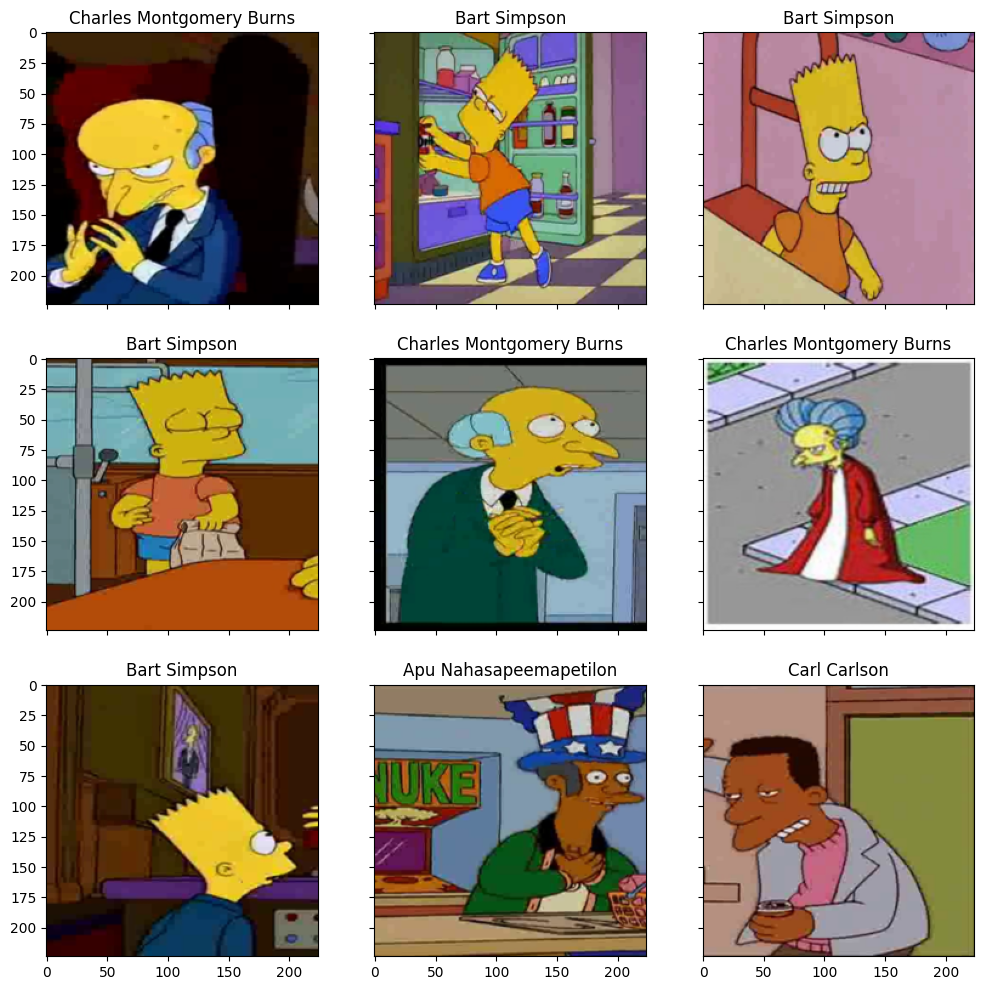
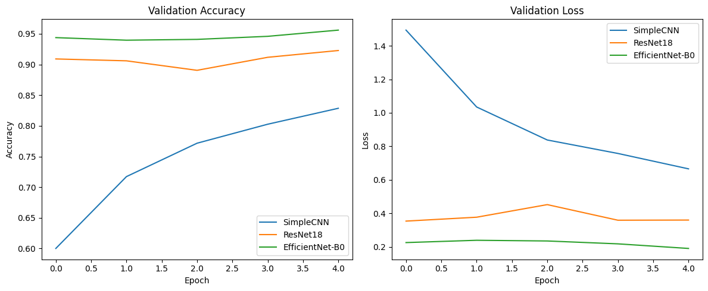
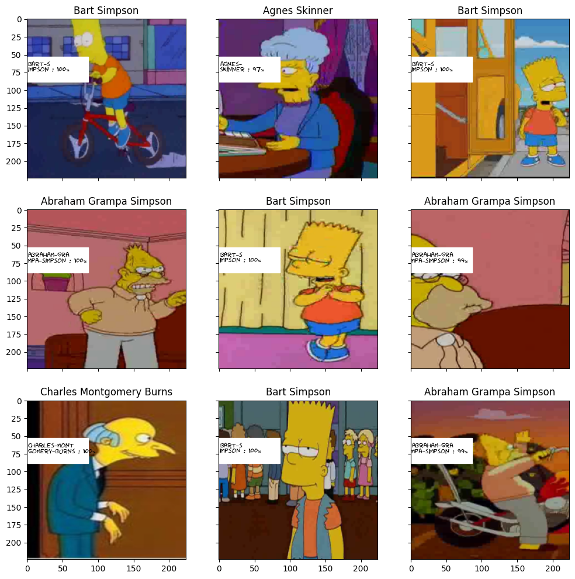

# Simpsons Character Classification with CNNs

Классификация персонажей мультсериала Simpsons с помощью сверточных нейросетей (PyTorch).

Проект посвящен сравнению нескольких CNN-архитектур для задачи multiclass image classification в рамках соревнования Deep Learning School / Kaggle.

## Dataset samples



# Challenges

- strong class imbalance
- visually similar characters
- different image resolutions
- pose and illumination variations
- overfitting during longer training

---

# Result

 Public Leaderboard Score: 0.98618

Лучший результат был получен с помощью fine-tuned EfficientNet-B0.

---

# STAR Format

## Situation

В рамках соревнования необходимо было построить модель классификации персонажей Simpsons по изображениям.

Особенности задачи:

- большое количество классов
- сильный дисбаланс персонажей
- различия в освещении, позах и масштабе
- ограниченное время обучения

Требовалось найти архитектуру, которая обеспечит высокую accuracy при разумном времени обучения.

---

## Task

Были поставлены задачи:

- реализовать полный pipeline классификации изображений
- подготовить dataloader и preprocessing
- сравнить несколько CNN-архитектур
- провести fine-tuning pretrained моделей
- визуализировать качество предсказаний
- подготовить inference pipeline и Kaggle submission

---

## Actions

### 1. Подготовка датасета

Реализован кастомный `SimpsonsDataset`:

- загрузка изображений
- train/validation split
- torchvision transforms
- batching через DataLoader

---

### 2. Baseline: SimpleCNN

Реализована собственная CNN:

- Conv2D
- BatchNorm
- ReLU
- MaxPooling
- Dropout

Результат:

- validation accuracy: **0.8286**
- training time: ~7 min

---

### 3. Transfer Learning: ResNet18

Добавлен fine-tuning pretrained ResNet18.

Использовались:

- заморозка части слоев
- адаптация classification head
- transfer learning

Результат:

- validation accuracy: **0.9228**
- training time: ~6 min

---

### 4. EfficientNet-B0

Проведен fine-tuning EfficientNet-B0.

Преимущества:

- better feature extraction
- меньше параметров
- высокая accuracy при небольшом размере модели

Результат:

- validation accuracy: **0.9561**
- training time: ~7 min

---

## Model comparison



### 5. Final Training

# Best Model

EfficientNet-B0
- Validation Accuracy: 0.9631
- Kaggle Score: 0.98618
- Training Time: ~9 minutes on Tesla T4

Для лучшей модели:

- увеличен batch size
- увеличено число эпох
- сохранены веса модели
- выполнен inference на test dataset

---

### 6. Visualization

Реализована визуализация:

- prediction confidence
- true/pred labels
- probability distribution
- примеры уверенных и ошибочных предсказаний

## Prediction examples



---

## Result

Финальный результат:

| Model | Train Time | Val Accuracy |
|---|---|---|
| SimpleCNN | 7m 17s | 0.8286 |
| ResNet18 | 6m 26s | 0.9228 |
| EfficientNet-B0 | 6m 47s | 0.9561 |
| EfficientNet-B0 (extended training) | 9m 07s | 0.9631 |

Final Kaggle score: **0.98618**

# Key Findings

- Transfer learning dramatically improved convergence speed and validation accuracy.
- EfficientNet-B0 achieved the best accuracy-quality tradeoff.
- Even a lightweight custom CNN achieved >82% validation accuracy.
- Fine-tuning pretrained models provided +13% absolute accuracy improvement over baseline CNN.
- Additional EfficientNet training increased validation accuracy from 0.9561 to 0.9631.

---

# Tech Stack

- Python
- PyTorch
- torchvision
- NumPy
- pandas
- matplotlib
- scikit-learn

---

# Repository Structure

## Структура проекта

    project/
    │
    ├── notebooks/
    │   └── Simpsons_98.ipynb
    │
    ├── src/
    │   ├── config.py
    │   ├── dataset.py
    │   ├── models.py
    │   ├── train.py
    │   ├── evaluate.py
    │   ├── inference.py
    │   └── visualize.py
    │
    ├── assets/
    │   ├── dataset.png
    │   ├── result.png
    │   ├── final_model_loss.png
    │   └── training_curves.png
    │
    ├── requirements.txt
    └── README.md

## Run

```bash
python src/train.py \
  --train-dir /kaggle/input/journey-springfield/train/simpsons_dataset \
  --model efficientnet_b0 \
  --weights-path /kaggle/input/efficientnet-b0/efficientnet_b0_rwightman-7f5810bc.pth \
  --epochs 5 \
  --batch-size 32 \
  --output-dir outputs
```

```bash
python src/inference.py \
  --test-dir /kaggle/input/journey-springfield/testset \
  --model efficientnet_b0 \
  --checkpoint outputs/best_efficientnet_b0.pth \
  --label-encoder outputs/label_encoder.pkl \
  --output outputs/submission.csv
```

# Key ML Concepts

В проекте использовались:

- CNN
- Transfer Learning
- Fine-tuning
- EfficientNet
- Batch Normalization
- Dropout
- Data Augmentation
- Multiclass Classification

# Possible Improvements

- cosine scheduler
- mixed precision training
- test-time augmentation
- ensemble нескольких моделей
- k-fold validation
- label smoothing
- focal loss для редких классов
