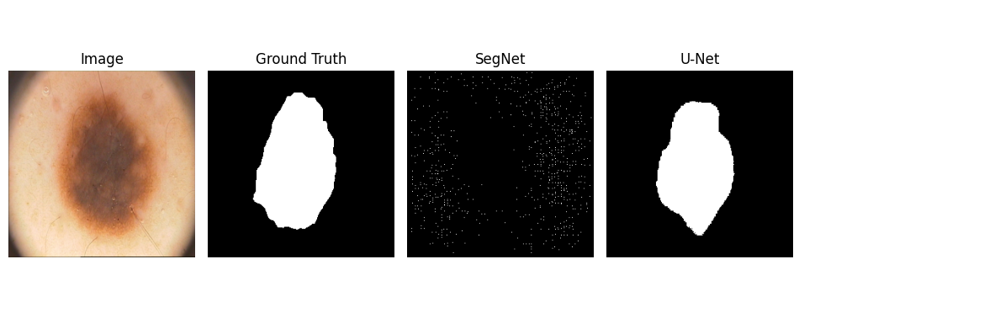
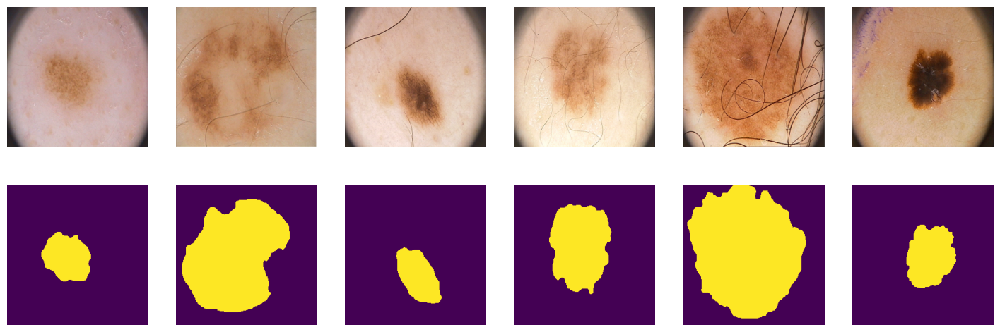
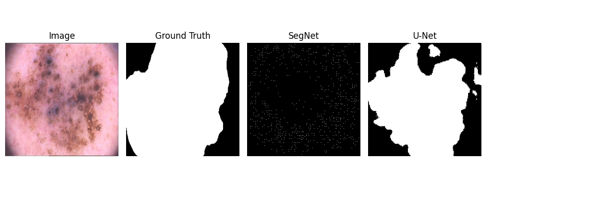
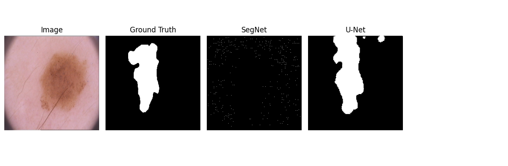
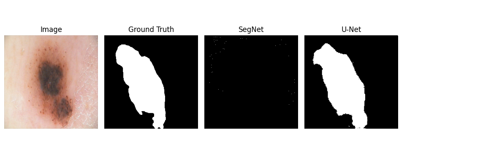
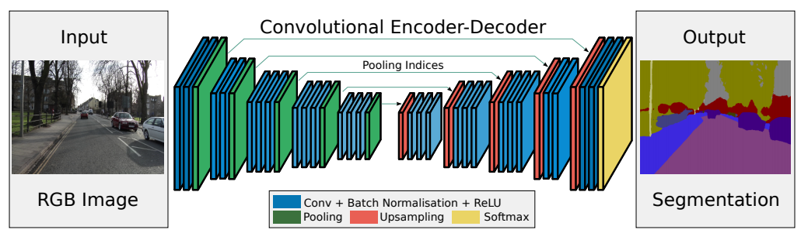
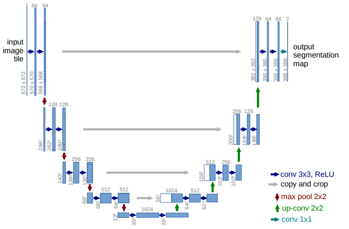
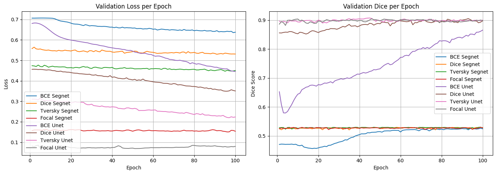

# Skin Lesion Segmentation with U-Net and SegNet

Проект представляет собой proof-of-concept CV-системы для автоматической сегментации кожных поражений на дерматоскопических изображениях.

Такая система может использоваться как вспомогательный инструмент в медицинских ML-продуктах:
- предварительное выделение области поражения;
- ускорение ручной разметки врачом/экспертом;
- подготовка ROI для последующей классификации риска;
- контроль качества дерматоскопических снимков и разметки.

Сравнение архитектур U-Net и SegNet для сегментации кожных поражений на PH2 Dataset.



## Situation

В задачах дерматоскопии врачу важно быстро и стабильно выделять границы подозрительного кожного образования. Ручная разметка занимает время и зависит от эксперта, поэтому автоматическая сегментация может быть полезна как вспомогательный этап перед диагностикой, расчетом площади поражения или построением последующей классификационной модели.

## Task

Использовался датасет PH2 с дерматоскопическими изображениями и бинарными масками поражений.



Нужно было:

- загрузить и подготовить PH2 Dataset;
- привести изображения и маски к размеру 256×256;
- обучить модели SegNet и U-Net для бинарной сегментации;
- сравнить BCE, Dice, Tversky и Focal Loss;
- оценить качество по Dice и IoU;
- сохранить лучший checkpoint;
- визуализировать предсказанные маски;
- оформить проект так, чтобы его можно было запустить не только из ноутбука, но и из командной строки.

## Action

Что реализовано:

- `src/prepare_dataset.py` — подготовка датасета и train/val/test split;
- `src/models.py` — реализации SegNet и U-Net;
- `src/losses.py` — BCE, Dice, Tversky, Focal Loss;
- `src/metrics.py` — Dice Score и IoU;
- `src/train.py` — обучение модели, логирование метрик, сохранение лучшего checkpoint;
- `src/evaluate.py` — оценка на test split;
- `src/visualize_predictions.py` — сохранение примеров: исходное изображение, ground truth mask, prediction;
- `notebooks/Unet_original.ipynb` — исходный исследовательский ноутбук.

## Result

В исходном эксперименте использовался PH2 Dataset: 200 дерматоскопических изображений с масками поражений.

| Модель | Loss | Val Dice | Val Loss | Время 100 эпох |
|---|---:|---:|---:|---:|
| SegNet | BCE | 0.478 | 0.590 | 26.43 сек |
| SegNet | Dice | 0.621 | 0.574 | 25.93 сек |
| SegNet | Tversky | 0.692 | 0.521 | 27.08 сек |
| SegNet | Focal | 0.687 | 0.109 | 29.88 сек |
| U-Net | BCE | 0.866 | 0.446 | 33.36 сек |
| U-Net | Dice | 0.898 | 0.351 | 28.93 сек |
| U-Net | Tversky | **0.900** | 0.224 | 30.30 сек |
| U-Net | Focal | 0.899 | **0.080** | 33.42 сек |

Лучший результат показала модель **U-Net** с **Tversky Loss**: Val Dice = 0.900.

U-Net стабильно превосходит SegNet на всех функциях потерь. Разрыв особенно заметен для BCE: 0.866 против 0.478 Dice. Это показывает, что skip-connections в U-Net критичны для восстановления точной формы медицинской маски.

SegNet оказался слабым baseline для данной задачи. На визуализациях видно, что модель часто предсказывает разреженный шум вместо цельной области поражения. Даже при использовании Tversky и Focal Loss качество ограничивается Dice ≈ 0.69.

Это говорит о том, что архитектура без прямых skip-connections хуже сохраняет пространственную информацию для малых медицинских датасетов.

## Визуальное сравнение предсказаний

### Примеры







### Qualitative analysis

Визуальная проверка показывает:

- U-Net хорошо восстанавливает основную область поражения;
- модель лучше работает на компактных и контрастных lesion;
- на крупных, размытых или неоднородных поражениях возможны переоценка площади и ложные фрагменты;
- SegNet часто даёт шумовую маску и плохо восстанавливает контур объекта.

Ограничения:

- небольшой датасет: 200 изображений;
- split 100/50/50 даёт ограниченную статистическую устойчивость;
- не использовалась k-fold cross-validation;
- не применялись продвинутые аугментации;
- модель решает только задачу сегментации, не классификацию заболевания;
- результат не является медицинским диагнозом.

## Архитектуры

### SegNet

<p align="center">
  
</p>

### U-Net

<p align="center">
  
</p>

## Сравнение моделей и loss-функций



## Структура репозитория

```text
.
├── README.md
├── requirements.txt
├── .gitignore
├── notebooks/
│   └── Unet_original.ipynb
├── assets/
│   ├── all_losses.png
│   ├── unet_losses.png
│   ├── segnet_losses.png
│   ├── dataset.png
│   ├── unet.png
│   ├── segnet.png
│   ├── res1.png
│   ├── res2.png
│   ├── res3.png
│   └── res4.png
├── src/
│   ├── config.py
│   ├── download_data.py
│   ├── prepare_dataset.py
│   ├── dataset.py
│   ├── models.py
│   ├── losses.py
│   ├── metrics.py
│   ├── train.py
│   ├── evaluate.py
│   └── visualize_predictions.py
```

## Быстрый старт

Установка зависимостей:

```bash
pip install -r requirements.txt
```

Скачать архив PH2:

```bash
python src/download_data.py --output-dir data/raw
```

После скачивания архив нужно распаковать так, чтобы структура была примерно такой:

```text
data/raw/PH2Dataset/PH2 Dataset images/...
```

Подготовить `.npy`-массивы:

```bash
python src/prepare_dataset.py \
  --dataset-dir data/raw/PH2Dataset \
  --output-dir data/processed
```

Обучить U-Net с Tversky Loss:

```bash
python src/train.py \
  --model unet \
  --loss tversky \
  --epochs 100 \
  --batch-size 25
```

Оценить модель:

```bash
python src/evaluate.py \
  --model unet \
  --loss tversky
```

Сохранить визуализации предсказаний:

```bash
python src/visualize_predictions.py \
  --model unet \
  --loss tversky \
  --split test \
  --output reports/predictions.png
```

## Стек

- Python
- PyTorch
- TorchVision
- TorchMetrics
- NumPy
- scikit-image
- scikit-learn
- Matplotlib
- tqdm

## Что можно улучшить дальше

- добавить аугментации изображений и масок;
- сделать k-fold cross-validation из-за маленького размера PH2;
- добавить threshold sweep для выбора оптимального порога бинаризации;
- сравнить с pretrained encoder U-Net;
- добавить inference-скрипт для одного изображения;
- завернуть модель в минимальный Streamlit/FastAPI demo;
- логировать эксперименты через MLflow или Weights & Biases.

## Итого

> Разработан воспроизводимый PyTorch-пайплайн для бинарной сегментации кожных поражений на дерматоскопических изображениях PH2: подготовка данных, реализация SegNet/U-Net, сравнение BCE/Dice/Tversky/Focal Loss, оценка по Dice/IoU и визуализация предсказаний. Лучший эксперимент: U-Net + Tversky Loss, validation Dice ≈ 0.90.