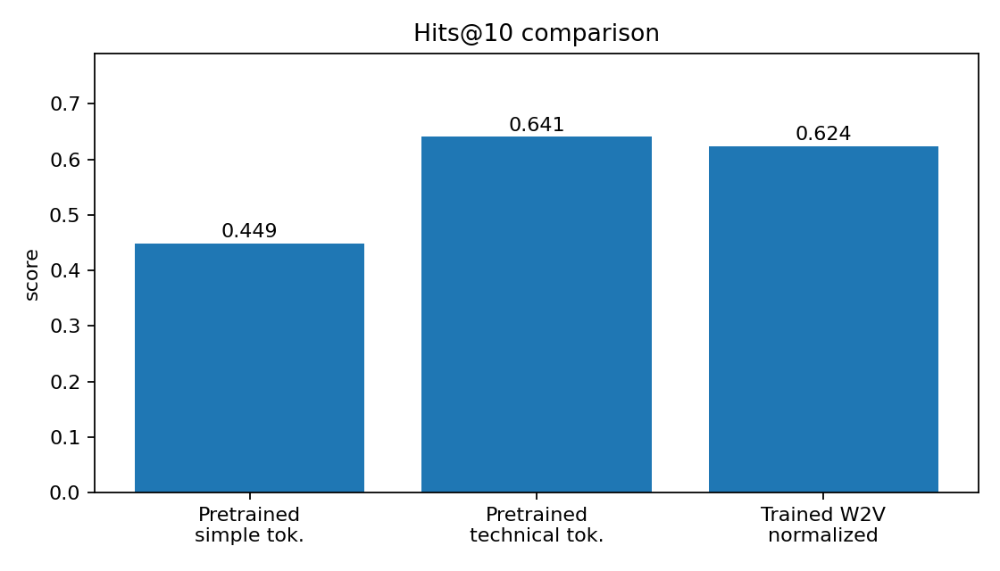
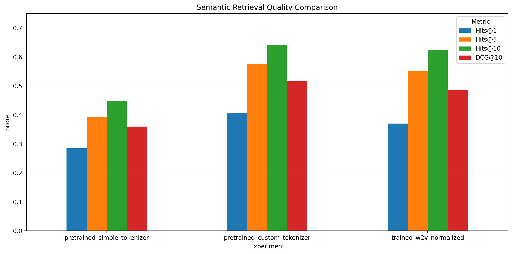

# StackOverflow Semantic Search with Word Embeddings

Проект решает задачу **семантического поиска похожих вопросов StackOverflow**: по исходному вопросу нужно ранжировать список кандидатов так, чтобы настоящий дубликат оказался как можно выше.

В основе решения — sentence embeddings через усреднение Word2Vec-векторов, cosine similarity и оценка качества ранжирования через **Hits@K** и **DCG@K**.



## Situation

На StackOverflow часто появляются вопросы, которые уже были заданы ранее в похожей формулировке. Для пользователя это проблема поиска: нужно быстро найти релевантный существующий ответ, даже если формулировки отличаются.

Особенность технических текстов в том, что обычная токенизация ломает важные сущности: `c++`, `c#`, `.net`, `node.js`, `python-3.x`. Поэтому для задачи semantic search важно не только выбрать embeddings, но и корректно обработать технические токены.

## Task

Цель проекта — построить простой, воспроизводимый baseline для semantic retrieval:

- представить вопрос вектором фиксированной длины;
- отсортировать кандидатов по семантической близости;
- измерить качество через Hits@K и DCG@K;
- сравнить влияние токенизации и обучения собственных Word2Vec-векторов.

Формат validation-примера:

```text
query \t true_duplicate \t distractor_1 \t distractor_2 \t ...
```

Так как правильный дубликат стоит первым среди кандидатов, после ранжирования можно измерить его позицию.

## Action

Что было реализовано:

- загрузка TSV-корпуса StackOverflow questions;
- baseline tokenizer на `\w+`;
- technical tokenizer, сохраняющий programming tokens с символами `+`, `#`, `.`, `-`;
- преобразование вопроса в sentence embedding через mean pooling Word2Vec-токенов;
- ranking кандидатов через cosine similarity;
- метрики `Hits@K` и `DCG@K`;
- эксперименты с pretrained StackOverflow Word2Vec;
- обучение Word2Vec на train split;
- сравнение параметров `window`, `min_count` и нормализации токенов.

Ключевой инженерный вывод: **качество токенизации оказалось важнее, чем простое переобучение Word2Vec на train-корпусе**.

## Result

Оценка проводилась на первых 1000 validation examples.

| Подход | Hits@1 | Hits@5 | Hits@10 | DCG@10 |
|---|---:|---:|---:|---:|
| Pretrained SO Word2Vec + simple tokenizer | 0.285 | 0.393 | 0.449 | 0.360 |
| Pretrained SO Word2Vec + technical tokenizer | **0.407** | **0.575** | **0.641** | **0.516** |
| Trained Word2Vec + normalized technical tokens | 0.370 | 0.551 | 0.624 | 0.487 |

Прирост от улучшенной токенизации:

- `Hits@1`: 0.285 → 0.407;
- `Hits@10`: 0.449 → 0.641;
- `DCG@10`: 0.360 → 0.516.

Это означает, что после доработки токенизации настоящий дубликат попадает в топ-10 примерно в **64.1%** случаев на тестируемом validation subset.

## Project structure

```text
stackoverflow-semantic-search/
├── README.md
├── requirements.txt
├── configs/
│   └── word2vec.yaml
├── src/
│   ├── data.py
│   ├── tokenization.py
│   ├── embeddings.py
│   ├── ranking.py
│   ├── metrics.py
│   ├── evaluate.py
│   ├── train_word2vec.py
│   └── download_embeddings.py
├── notebooks/
│   └── experiments.ipynb
└── assets/
    ├── hits1_comparison.png
    ├── hits10_comparison.png
    └── dcg10_comparison.png
```

## Installation

```bash
python -m venv .venv
source .venv/bin/activate  # Windows: .venv\Scripts\activate
pip install -r requirements.txt
```

## Data

Проект ожидает данные в формате:

```text
data/
├── train.tsv
└── validation.tsv
```

Pretrained StackOverflow Word2Vec можно скачать командой:

```bash
python src/download_embeddings.py --output data/SO_vectors_200.bin
```

Источник pretrained vectors: StackOverflow Word2Vec model from Zenodo / SO_word2vec.

## Evaluation

Оценка pretrained vectors с technical tokenizer:

```bash
python -m src.evaluate \
  --validation-path data/validation.tsv \
  --embeddings-path data/SO_vectors_200.bin \
  --tokenizer technical \
  --max-examples 1000
```

Оценка baseline tokenizer:

```bash
python -m src.evaluate \
  --validation-path data/validation.tsv \
  --embeddings-path data/SO_vectors_200.bin \
  --tokenizer simple \
  --max-examples 1000
```

## Train custom Word2Vec

```bash
python -m src.train_word2vec \
  --train-path data/train.tsv \
  --output models/word2vec_stackoverflow.bin \
  --window 12 \
  --min-count 5 \
  --normalize
```

После этого модель можно оценить тем же скриптом `evaluate.py`, передав путь к обученным векторам.

## Metrics

### Hits@K

Доля запросов, для которых настоящий дубликат попал в первые `K` позиций ранжированного списка.

### DCG@K

Метрика учитывает не только факт попадания в top-K, но и позицию релевантного результата: чем выше дубликат в выдаче, тем больше вклад.



## Main findings

1. **Technical tokenizer заметно улучшает retrieval quality.**
   Простая токенизация теряет важные programming-language tokens, что критично для StackOverflow.

2. **Mean Word2Vec embeddings дают рабочий baseline.**
   Даже без transformer-based моделей можно получить интерпретируемый и быстрый retrieval pipeline.

3. **Дообучение Word2Vec не гарантирует улучшение относительно pretrained модели.**
   В экспериментах pretrained StackOverflow vectors + хорошая токенизация дали лучший результат.

## Limitations

- Mean pooling не учитывает порядок слов.
- Word2Vec плохо различает контекстные значения одного и того же токена.
- Нет fine-tuning под конкретную retrieval-задачу.
- Нет ANN-индекса для масштабного поиска по большой базе вопросов.
- Validation использует subset из 1000 examples для быстрых экспериментов.

## Future work

- заменить Word2Vec baseline на Sentence-BERT / MiniLM;
- добавить FAISS для быстрого similarity search;
- сделать error analysis: хорошие и плохие retrieval examples;
- добавить сравнение TF-IDF / BM25 / Word2Vec / SBERT;
- завернуть pipeline в небольшой demo-сервис или Streamlit-приложение.

## Tech stack

Python, NumPy, Gensim, scikit-learn, Pandas, Matplotlib, NLTK.
