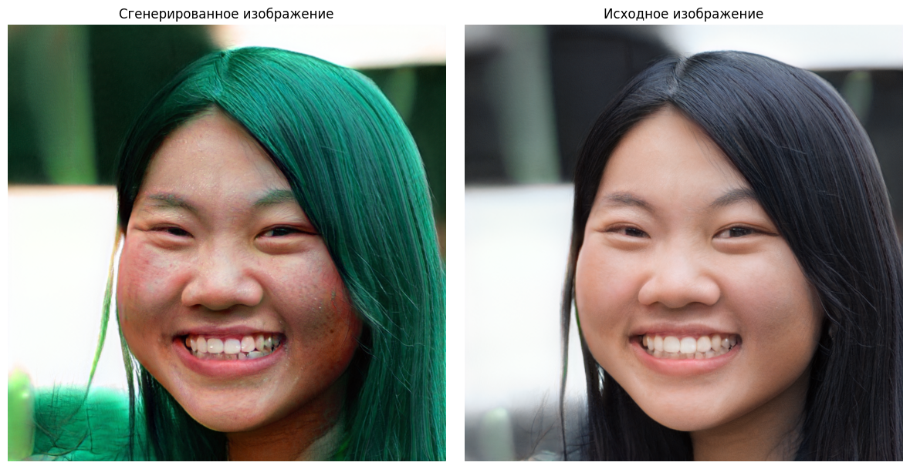
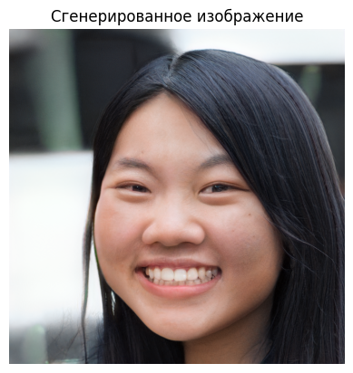
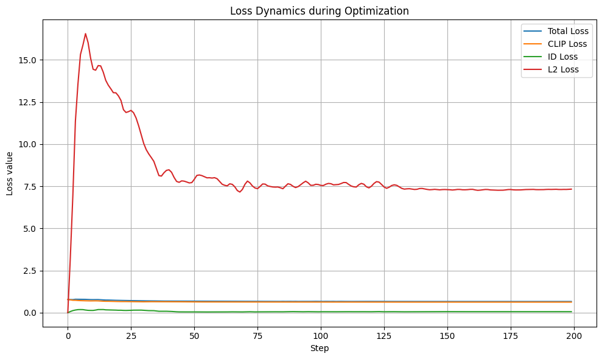
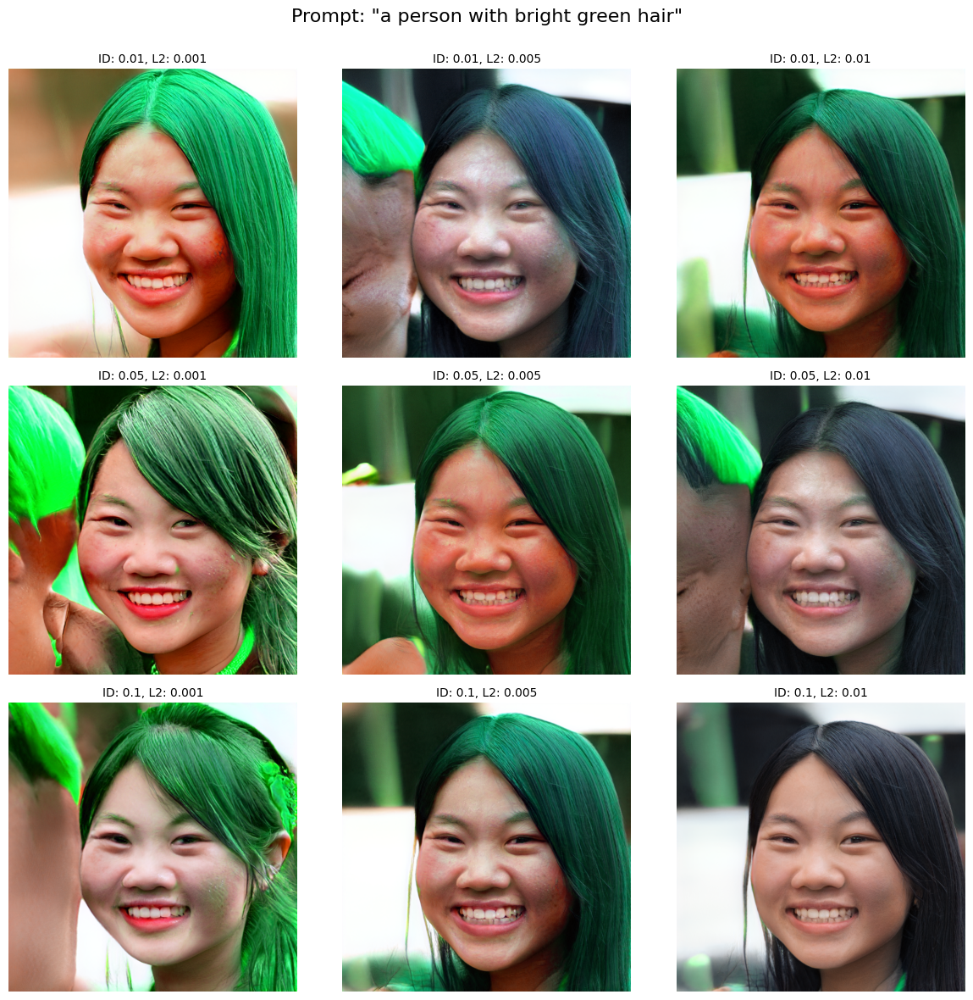
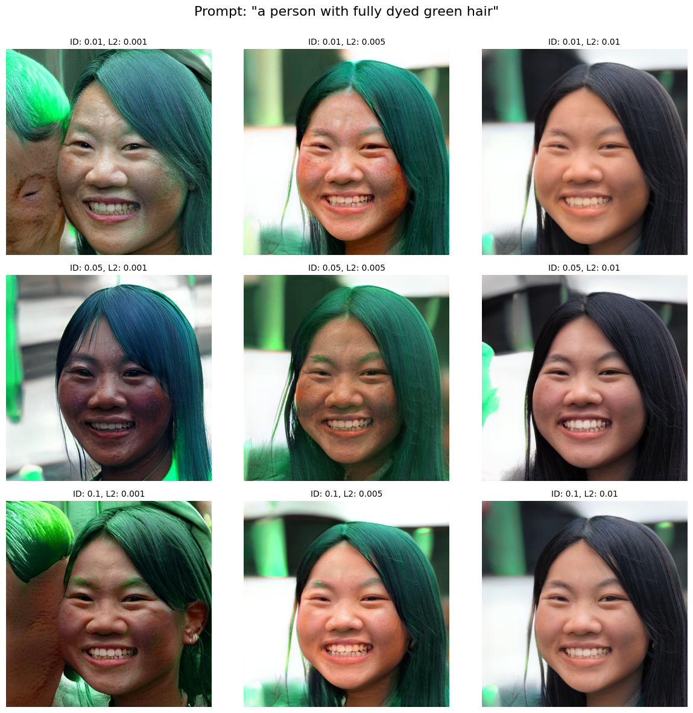

# Text-Guided Face Editing with StyleGAN2, CLIP and ArcFace

Проект демонстрирует пайплайн текстового редактирования синтетического портрета: изображение генерируется через StyleGAN2, затем латентный вектор оптимизируется под текстовый запрос с помощью CLIP Loss, L2-регуляризации и ArcFace-based ID Loss для сохранения identity.



## Situation

В генеративных CV-задачах важно не только создать реалистичное изображение, но и управляемо менять отдельные атрибуты: цвет волос, стиль, выражение, возраст, аксессуары. Проблема в том, что сильная текстовая оптимизация часто “ломает” исходное лицо: меняются черты, выражение, геометрия или появляются артефакты.

## Task

Нужно было реализовать proof-of-concept text-guided image editing:

- сгенерировать исходное лицо с помощью StyleGAN2;
- реализовать CLIP Loss для соответствия изображения текстовому промпту;
- реализовать ID Loss на основе ArcFace, чтобы сохранить identity;
- добавить L2-регуляризацию латентного вектора;
- провести ручной подбор коэффициентов `id_lambda` и `l2_lambda`;
- сравнить, как разные значения коэффициентов влияют на результат.

Основной промпт:

```text
a person with bright green hair
```

## Action

### 1. Подготовка генератора

Использовался StyleGAN2 generator для FFHQ-разрешения `1024x1024`. Исходное изображение получалось из усредненного latent noise:

```python
latent_z = torch.randn(10000, 512, device=device)
latent_z_generated = latent_z.mean(0, keepdim=True)
```

Исходный результат:



### 2. CLIP Loss

CLIP использовался как текстово-визуальный guidance. Для изображения и текстового промпта извлекались эмбеддинги, затем минимизировалось косинусное расстояние:

```text
D_CLIP(image, text) = 1 - cosine_similarity(CLIP(image), CLIP(text))
```

CLIP Loss отвечает за то, чтобы результат стал похож на описание из промпта.

### 3. ID Loss

Для сохранения похожести на исходного человека была добавлена ArcFace-модель. Она извлекает face embedding исходного и отредактированного изображения. ID Loss штрафует изменение identity:

```text
L_ID = 1 - dot(R(original), R(edited))
```

### 4. L2-регуляризация latent-вектора

Чтобы оптимизация не уводила latent слишком далеко от исходной точки, использовалась регуляризация:

```text
L2 = ||w - w_source||^2
```

Итоговая функция потерь:

```text
Loss = CLIP Loss + l2_lambda * L2 Loss + id_lambda * ID Loss
```

### 5. Оптимизация

Латентный вектор `w` оптимизировался через Adam:

```python
optimizer = torch.optim.Adam([latent], lr=0.08)
scheduler = torch.optim.lr_scheduler.ExponentialLR(optimizer, gamma=0.99)
```

Основной эксперимент:

- `num_steps = 200`
- `l2_lambda = 0.0045`
- `id_lambda = 0.06`
- optimizer: Adam
- scheduler: ExponentialLR
- CLIP backbone: `ViT-B/32`

Динамика функции потерь:



## Result

В результате удалось получить управляемое редактирование: волосы окрашиваются в зеленый цвет, при этом лицо остается узнаваемым и не разваливается в артефакты.

Финальный ход оптимизации:


Дополнительно был проведен grid search по коэффициентам:

```python
prompts = [
    "a person with bright green hair",
    "a person with fully dyed green hair",
]

id_lambdas = [0.01, 0.05, 0.1]
l2_lambdas = [0.001, 0.005, 0.01]
num_steps = 50
```

### Что показал подбор коэффициентов





Наблюдения:

- низкий `id_lambda` дает более сильные изменения, но повышает риск потери identity;
- высокий `id_lambda` лучше сохраняет лицо, но может ослаблять редактирование;
- низкий `l2_lambda` дает насыщенное изменение цвета, но чаще приводит к артефактам;
- высокий `l2_lambda` делает результат стабильнее, но ограничивает силу изменения;
- субъективно лучший баланс: prompt `a person with bright green hair`, `id_lambda = 0.1`, `l2_lambda = 0.005`;
- основной вручную подобранный вариант: `id_lambda = 0.06`, `l2_lambda = 0.0045`.

## Репозиторий

```text
.
├── README.md
├── requirements.txt
├── scripts/
│   └── run_colab.sh
├── src/
│   ├── arcface.py
│   ├── losses.py
│   ├── optimize.py
│   ├── plot_grid.py
│   └── utils.py
└── assets/
    ├── notebook_cell_14_0.png
    ├── notebook_cell_35_0.png
    ├── notebook_cell_41_0.png
    └── notebook_cell_41_1.png
```

## Как запустить

Проект рассчитан на Google Colab / GPU-окружение.

### 1. Установить зависимости

```bash
pip install -r requirements.txt
```

Дополнительно нужен репозиторий `stylegan2-pytorch`:

```bash
git clone https://github.com/rosinality/stylegan2-pytorch.git
```

### 2. Скачать веса

В оригинальном ноутбуке веса StyleGAN2 FFHQ и ArcFace загружались через Google Drive:

- `stylegan2-ffhq-config-f.pt`
- `model_ir_se50.pth`

Их нужно положить в папку с `stylegan2-pytorch` или передать пути через аргументы CLI.

### 3. Запустить оптимизацию

```bash
python src/optimize.py \
  --stylegan-dir stylegan2-pytorch \
  --stylegan-weights stylegan2-pytorch/stylegan2-ffhq-config-f.pt \
  --arcface-weights stylegan2-pytorch/model_ir_se50.pth \
  --prompt "a person with bright green hair" \
  --num-steps 200 \
  --id-lambda 0.06 \
  --l2-lambda 0.0045 \
  --output-dir results
```

### 4. Запустить grid search

```bash
python src/optimize.py \
  --stylegan-dir stylegan2-pytorch \
  --stylegan-weights stylegan2-pytorch/stylegan2-ffhq-config-f.pt \
  --arcface-weights stylegan2-pytorch/model_ir_se50.pth \
  --grid-search \
  --num-steps 50 \
  --output-dir generated_grid
```

## Стек

- Python
- PyTorch
- torchvision
- OpenAI CLIP
- StyleGAN2
- ArcFace / InsightFace-style backbone
- PIL
- matplotlib
- NumPy

## Ограничения

- проект использует предобученные веса StyleGAN2 и ArcFace;
- запуск требует GPU;
- результат чувствителен к промпту и коэффициентам регуляризации;
- CLIP-guided optimization может усиливать bias генеративной модели и датасета;
- подбор коэффициентов выполнялся вручную / через небольшой grid search.

## Что можно улучшить

- добавить автоматический подбор `id_lambda` и `l2_lambda`;
- логировать метрики в CSV;
- добавить сравнение нескольких seed;
- вынести загрузку весов в отдельный скрипт;
- добавить поддержку пользовательского исходного изображения через GAN inversion;
- добавить более аккуратный отчет по bias/robustness для разных промптов.
