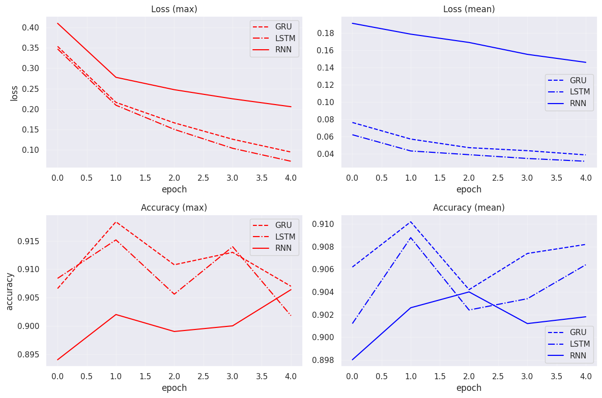
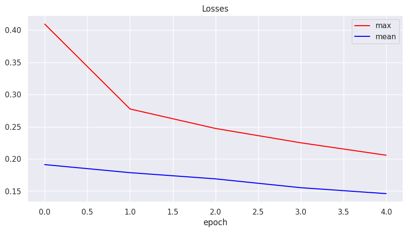
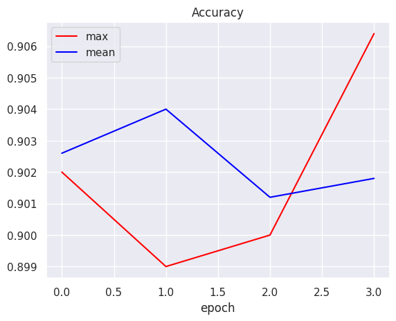
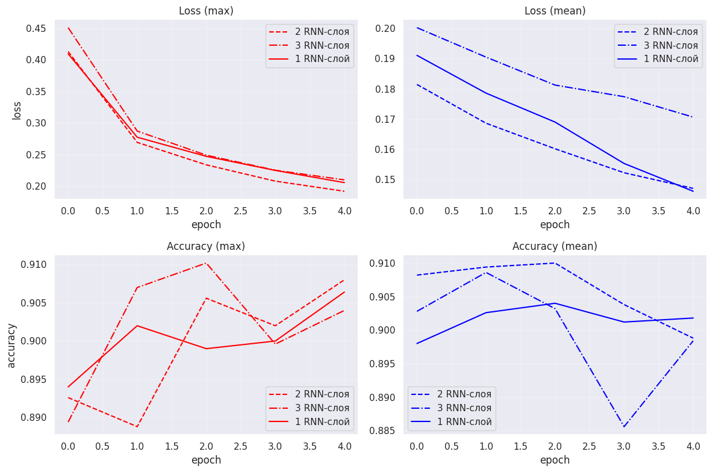
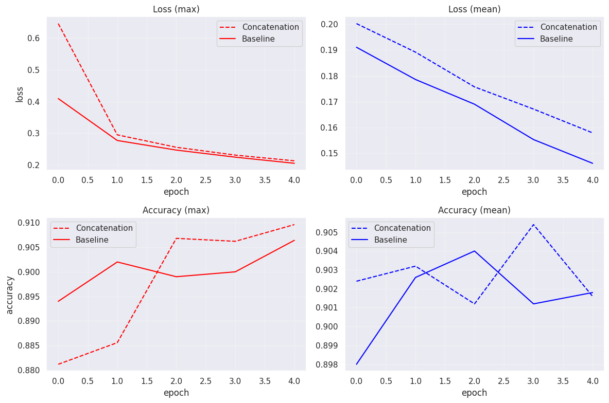
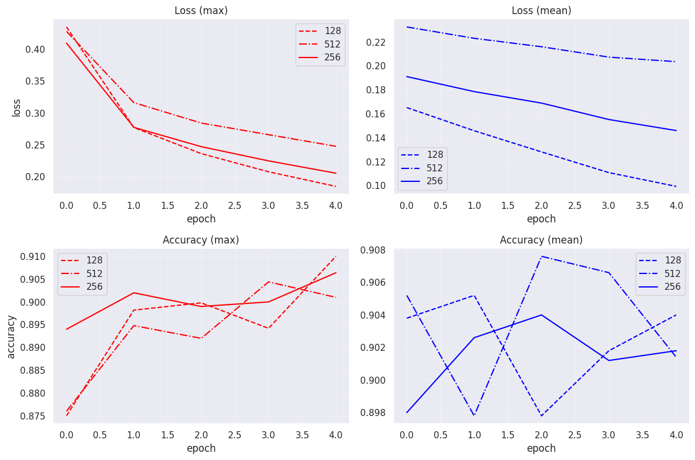
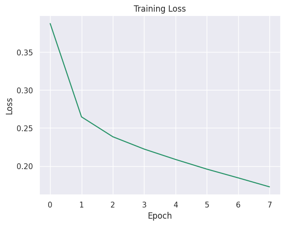
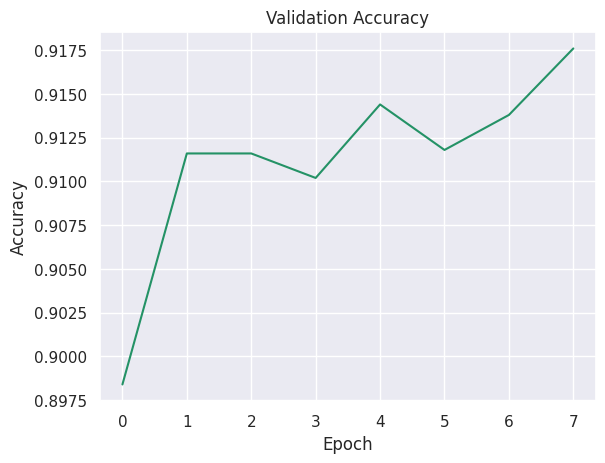

# NLP Text Classification Research with RNN, GRU and LSTM

Исследовательский NLP-проект по классификации новостей на датасете AG News с использованием recurrent neural networks.



В проекте исследуются:
- RNN
- GRU
- LSTM
- многослойные RNN
- pooling strategies
- архитектурные модификации
- влияние hidden dimension
- стабильность обучения recurrent-моделей

---

# Preview

## Задача

Классификация новостей по 4 категориям:

- World
- Sports
- Business
- Sci/Tech

Датасет:
AG News

---

# Situation

Необходимо построить baseline NLP pipeline для задачи многоклассовой классификации текстов и исследовать влияние различных recurrent-архитектур на качество классификации и стабильность обучения.

---

# Task

Построить и сравнить:
- RNN
- GRU
- LSTM
- stacked RNN
- modified recurrent architectures

Провести controlled experiments:
- pooling strategies
- число recurrent layers
- hidden dimension
- concat architectures
- training stabilization techniques

---

# Action

## Data Pipeline

Реализованы:
- text preprocessing
- tokenization
- vocabulary building
- numerical encoding
- padding/truncation
- custom Dataset/DataLoader

Используемые технологии:
- PyTorch
- NLTK
- HuggingFace Datasets

---

## Архитектуры

Исследованы:

### Baseline RNN
- 1-layer RNN
- max / mean pooling

### GRU
- GRU encoder
- max / mean pooling

### LSTM
- LSTM encoder
- max / mean pooling

### Stacked RNN
- 2-layer RNN
- 3-layer RNN

### Concat Architecture
Конкатенация:
- pooled representation
- hidden state последнего токена

---

## Эксперименты

Проведены эксперименты:

| Experiment | Goal |
|---|---|
| RNN vs GRU vs LSTM | сравнение recurrent architectures |
| 1 vs 2 vs 3 layers | влияние глубины |
| max vs mean pooling | влияние агрегации |
| concat(last hidden + pooled) | улучшение representation |
| hidden_dim = 128/256/512 | capacity analysis |
| longer training | convergence analysis |
| gradient clipping | stabilization |

## Experiment Results

| Model | Pooling | Best Accuracy |
|---|---:|---:|
| GRU-1x256 | max | 0.9184 |
| LSTM-1x256 | max | 0.9152 |
| GRU-1x256 | mean | 0.9102 |
| RNN-3x256 | max | 0.9102 |
| RNN-1x128 | max | 0.9100 |
| RNN-2x256 | mean | 0.9100 |
| Concat(agg + last)-256 | max | 0.9096 |
| RNN-1x256 baseline | max | 0.9064 |
| RNN-1x256 baseline | mean | 0.9040 |

---

# Result

## Лучший результат

Best model:

- architecture: GRU
- hidden_dim: 256
- pooling: max
- gradient clipping: 1.0
- best validation accuracy: **0.9176**

---
## Training Curves

### Baseline RNN

<p align="center">
  
  
</p>

### RNN vs GRU vs LSTM


### Number of RNN Layers



### Concat Architecture vs Baseline



### Hidden Dimension Comparison



### Final GRU Training

<p align="center">
  
  
</p>

## Основные выводы

### GRU показала лучший баланс:
- stability
- convergence speed
- peak accuracy

### Max pooling
- чаще давал лучшие peak metrics
- но менее стабилен

### Mean pooling
- более устойчивое обучение
- smoother convergence

### hidden_dim = 512
- приводил к переобучению
- ухудшал стабильность

### Concat architecture
- улучшала качество max pooling setup

### Deep recurrent stacks
- не дали значительного прироста
- ухудшали стабильность

---

# Technical Stack

- Python
- PyTorch
- HuggingFace Datasets
- NLTK
- NumPy
- Matplotlib
- Scikit-learn

---

# Project Structure

```text
nlp-text-classification/
│
├── README.md
├── requirements.txt
│
├── notebooks/
│   └── research.ipynb
│
├── src/
│   ├── data.py
│   ├── preprocessing.py
│   ├── dataset.py
│   ├── train.py
│   ├── evaluate.py
│   ├── utils.py
│   │
│   └── models/
│       ├── rnn.py
│       ├── gru.py
│       ├── lstm.py
│       ├── stacked_rnn.py
│       └── concat_rnn.py
│
├── checkpoints/
├── reports/
└── assets/
```

---

# Installation

```bash
git clone https://github.com/your_username/nlp-text-classification.git

cd nlp-text-classification

pip install -r requirements.txt
```

---

# Training

```bash
python src/train.py
```

---

# Inference

```bash
python inference.py --text "Apple releases new AI chip"
```

---

# Future Improvements

- Bidirectional RNNs
- Attention mechanisms
- Transformers / BERT
- pretrained embeddings
- torchtext integration
- hyperparameter search
- confusion matrix & F1 analysis

---

# Key Takeaway

Даже относительно простые recurrent architectures способны достигать высокого качества на задачах text classification при грамотном подборе:
- pooling strategy
- hidden dimension
- optimization setup
- training stabilization techniques