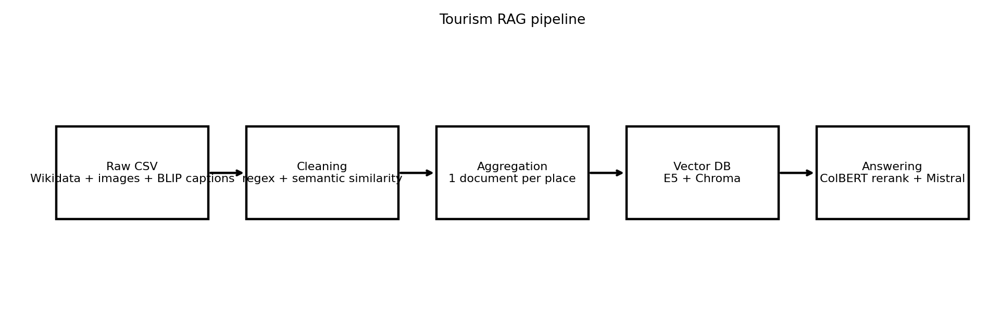
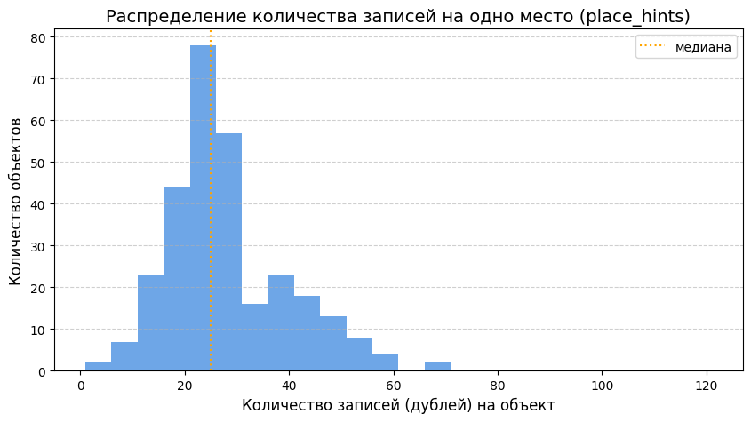
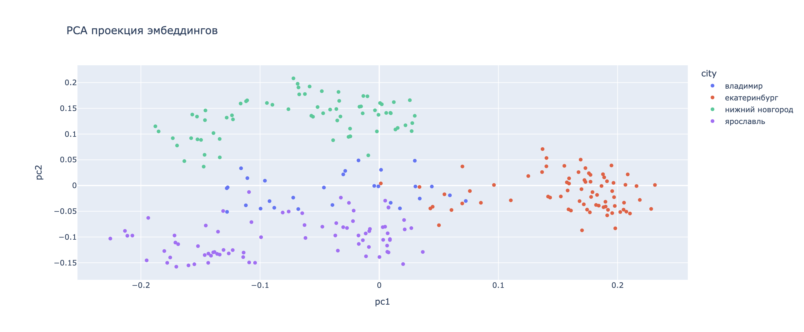
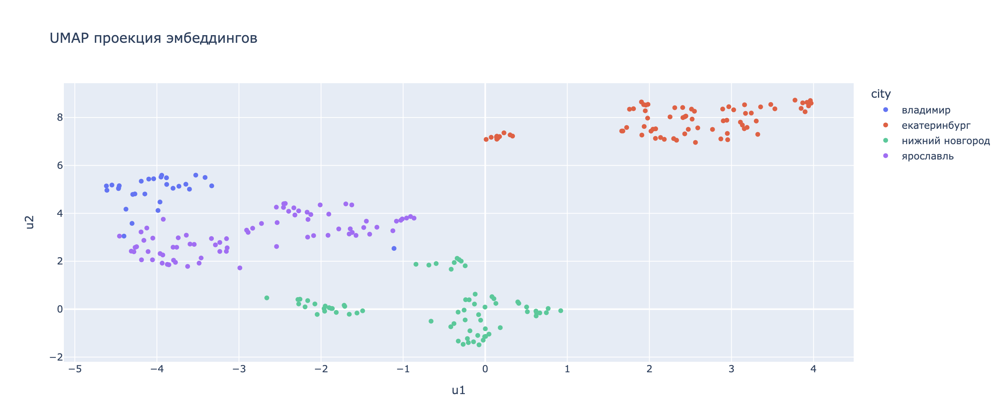
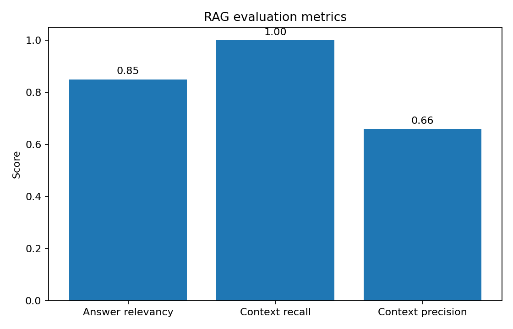

# Tourism RAG Assistant

Мультимодальная Retrieval-Augmented Generation (RAG) система для поиска и генерации ответов о туристических и исторических объектах России.

Проект объединяет:
- структурированные данные WikiData;
- изображения достопримечательностей;
- BLIP-caption описания изображений;
- retrieval pipeline на эмбеддингах;
- reranking через ColBERT;
- генерацию ответов с помощью Mistral.

---



---

# О проекте

Проект представляет собой end-to-end RAG pipeline для туристического поиска.

Система:
1. очищает и нормализует шумные мультимодальные данные;
2. агрегирует множество описаний одного объекта;
3. строит векторную базу знаний;
4. выполняет retrieval + reranking;
5. генерирует финальный ответ с опорой на найденный контекст.

---

# Situation

Исходный датасет содержал большое количество:
- дублей;
- шумных caption;
- несвязанных изображений;
- неполных описаний;
- различных вариантов одного и того же объекта.

Каждая достопримечательность могла встречаться десятки раз с разными текстами и изображениями.

### Примеры объектов


---

# Task

Построить retrieval-систему, способную:
- находить релевантные туристические объекты;
- агрегировать информацию из разных источников;
- уменьшать шум и дубли;
- генерировать качественные ответы на пользовательские запросы.

---

# Action

## 1. Очистка данных

Выполнены:
- regex-фильтрация мусорных записей;
- semantic deduplication;
- TF-IDF анализ шумных паттернов;
- нормализация текстов;
- фильтрация коротких и нерелевантных caption.

### Результаты очистки

| Этап | Количество |
|---|---|
| Raw rows | 12078 |
| После очистки | 8137 |
| Уникальных объектов | 295 |
| Среднее число дублей на объект | 27.58 |
| Максимум дублей | 70 |

### Распределение дублей



---

## 2. Агрегация документов

Для каждого объекта:
- выбирались наиболее репрезентативные описания;
- удалялись семантические дубли;
- объединялись:
  - WikiData descriptions;
  - BLIP image captions;
  - metadata;
  - пользовательские hints.

Итог:
- 250 полноценных документов для retrieval pipeline.

---

## 3. Построение retrieval pipeline

Использовались:
- `intfloat/e5-large-v2` — эмбеддинги;
- `ChromaDB` — векторная база;
- `ColBERTv2` — reranking;
- `Mistral-7B-Instruct` — генерация ответа.

Pipeline:
1. dense retrieval;
2. top-k candidate search;
3. ColBERT reranking;
4. answer generation.

---

## 4. Анализ embedding space

Построены PCA и UMAP проекции эмбеддингов.

Наблюдается кластеризация объектов по городам, что указывает на наличие семантической структуры в embedding space.

### PCA projection



### UMAP projection



---

# Result

## RAG metrics



| Метрика | Значение |
|---|---|
| Answer relevancy | 0.85 |
| Context recall | 1.00 |
| Context precision | 0.66 |

---

# Пример ответа системы

### Вопрос

> Что посмотреть в Ярославле, если люблю старинные храмы и набережную?

### Ответ

Система рекомендует:
- храм Ярославской иконы Божией Матери;
- приход Воздвижения Святого Креста;
- церковь Михаила Архангела;
- Толгский монастырь;
- набережную Волги и исторический центр города.

Ответ формируется на основе retrieval + reranking + генерации по найденным источникам.

---

# Используемые технологии

## NLP / RAG
- Sentence Transformers
- E5-large-v2
- ColBERTv2
- Mistral-7B-Instruct

## Vector Search
- ChromaDB

## Data Processing
- Pandas
- NumPy
- Scikit-learn
- Regex
- TF-IDF

## Visualization
- Matplotlib
- Seaborn
- PCA
- UMAP

---

# Структура проекта

```bash
tourism-rag-assistant/
│
├── assets/
│   ├── pipeline.png
│   ├── pca.png
│   ├── umap.png
│   ├── pics.png
│   ├── rag_metrics.png
│   └── data_distribution.png
│
├── notebooks/
│   └── RAG.ipynb
│
├── src/
│   ├── cleaning.py
│   ├── aggregation.py
│   ├── embeddings.py
│   ├── retrieval.py
│   ├── rerank.py
│   ├── generation.py
│   └── evaluation.py
│
├── app/
│   └── streamlit_app.py
│
├── requirements.txt
└── README.md
```

---

# Возможные улучшения

- hybrid retrieval (BM25 + dense retrieval);
- multilingual retrieval;
- image-text cross-modal embeddings;
- citation grounding;
- RAGAS evaluation;
- fine-tuning retrieval модели;
- production deployment.

---

# Запуск

## Установка

```bash
pip install -r requirements.txt
```

## Streamlit demo

```bash
streamlit run app/streamlit_app.py
```

---

## Авторская заметка

Проект можно позиционировать как end-to-end NLP/RAG portfolio project: здесь есть не только LLM-обёртка, но и работа с грязными данными, построение базы знаний, retrieval, reranking, evaluation и визуальная демонстрация результата.
