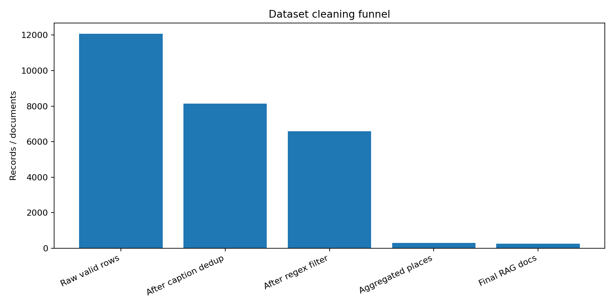

# Tourism RAG Assistant

RAG-система туристического гида по достопримечательностям: очистка мультимодального датасета, построение базы знаний, retrieval через векторную БД, reranking и генерация ответов на русском языке.


## STAR Summary

### Situation

В исходном датасете были описания туристических и исторических объектов, WikiData ID, города, координаты, изображения в base64 и автоматически сгенерированные описания изображений. Данные были шумными: встречались дубли, нерелевантные изображения, рекламные/социальные артефакты, подписи, плохо связанные с реальными достопримечательностями.

### Task

Собрать прототип туристического RAG-ассистента, который:

- очищает и агрегирует данные по достопримечательностям;
- строит поисковую базу знаний;
- отвечает на вопросы пользователя только на основе найденного контекста;
- визуализирует структуру эмбеддингов;
- оценивает качество retrieval/generation через RAGAS-подобные метрики.

### Action

В проекте реализован полный pipeline:

1. **Data cleaning**
   - нормализация текстов;
   - удаление дублей по BLIP-caption;
   - канонизация названий по `WikiData`;
   - regex-фильтрация мусорных описаний;
   - проверка смысловой близости `description` и `en_txt` через sentence-transformers;
   - агрегация нескольких записей в один документ на достопримечательность.

2. **Knowledge base**
   - каждая локация превращается в `LangChain Document`;
   - текст документа включает название, город, описание из WikiData и описание изображения;
   - embeddings строятся через `intfloat/multilingual-e5-base`;
   - документы сохраняются в `Chroma`.

3. **RAG pipeline**
   - top-k retrieval из Chroma;
   - удаление дублей;
   - reranking через `colbert-ir/colbertv2.0`;
   - reader-модель `Mistral-7B-Instruct`;
   - системный промпт запрещает галлюцинации и требует отвечать только по контексту.

4. **Evaluation**
   - генерация 100 QA-примеров;
   - `answer_relevancy` через семантическую близость ответа и follow-up questions;
   - `context_recall`;
   - `context_precision`.

5. **Visualization**
   - PCA-проекция эмбеддингов;
   - UMAP-проекция эмбеддингов;
   - графики cleaning funnel и итоговых метрик;
   - Streamlit-интерфейс для демонстрации RAG.

### Result

| Metric / artifact | Value |
|---|---:|
| Валидных строк после удаления пропусков | 12 078 |
| Строк после удаления дублей по `en_txt` | 8 137 |
| Доля regex-подозрительных записей | 19.1% |
| Строк после regex-фильтрации | 6 586 |
| Уникальных достопримечательностей | 295 |
| Итоговых документов для RAG | 250 |
| Максимальная длина текста | 53 токена |
| Лимит embedding-модели | 512 токенов |
| `answer_relevancy` | 0.850 |
| `context_recall` | 1.000 |
| `context_precision` | 0.660 |




## Пример использования

Вопрос:

```text
Что посмотреть в Ярославле, если люблю старинные храмы и набережную?
```

Ожидаемое поведение системы:

- найти документы по Ярославлю;
- поднять выше храмы, монастыри, исторические здания и объекты рядом с набережной;
- после reranking отдать LLM только наиболее релевантные источники;
- ответить на русском языке без выдумывания фактов вне контекста.

## Структура репозитория

```text
tourism-rag-assistant/
├── assets/
│   ├── data_cleaning_funnel.png
│   ├── pipeline.png
│   └── rag_metrics.png
├── data/
│   ├── raw/
│   └── processed/
├── notebooks/
│   └── RAG_original.ipynb
├── reports/
│   └── sample_query.md
├── src/
│   ├── app.py
│   ├── config.py
│   ├── data_preprocessing.py
│   ├── evaluate.py
│   ├── rag_pipeline.py
│   ├── vector_store.py
│   └── visualize_embeddings.py
├── .gitignore
├── Makefile
├── README.md
└── requirements.txt
```

## Быстрый старт

```bash
git clone <your-repo-url>
cd tourism-rag-assistant

python -m venv .venv
source .venv/bin/activate  # Windows: .venv\Scripts\activate

pip install -r requirements.txt
```

### 1. Подготовить данные

```bash
make prepare
```

или

```bash
python src/data_preprocessing.py
```

Скрипт скачает CSV из Google Drive, очистит данные и сохранит итоговый датасет в `data/processed/tourism_rag.csv`.

### 2. Построить Chroma index

```bash
make index
```

или

```bash
python src/vector_store.py
```

### 3. Построить визуализации эмбеддингов

```bash
make viz
```

Результаты сохраняются в:

```text
reports/pca_embeddings.html
reports/umap_embeddings.html
```

### 4. Запустить демо

```bash
make app
```

или

```bash
streamlit run src/app.py
```

## Ключевые решения

### Почему multilingual E5

В датасете смешаны русские, английские и потенциально другие описания. Поэтому использована multilingual embedding-модель `intfloat/multilingual-e5-base`, чтобы retrieval не ломался на разноязычных фрагментах.

### Почему Chroma

Chroma удобна для локального прототипа: быстро поднимается, не требует отдельного сервера и легко интегрируется с LangChain.

### Почему ColBERT reranking

Обычный dense retrieval хорошо находит кандидатов, но порядок документов в промпте влияет на ответ. Поэтому после top-k retrieval используется reranking через ColBERT, чтобы в финальный контекст попадали более точные документы.

### Почему нужна отдельная очистка

Без очистки база знаний начинает включать нерелевантные подписи: личные фото, баннеры, изображения людей, машины, рекламные и социальные артефакты. Это ухудшает retrieval и повышает риск галлюцинаций.

## Что можно улучшить

- заменить эвристический `context_precision` на полноценную LLM-as-a-judge оценку;
- добавить ручной golden set вопросов;
- сделать hybrid search: BM25 + dense retrieval;
- добавить фильтр по городу и типу достопримечательности;
- сохранить изображения отдельно и показывать их в Streamlit;
- добавить Dockerfile и GitHub Actions;
- вынести heavy inference в Colab/Kaggle pipeline.

## Стек

`Python`, `Pandas`, `NumPy`, `scikit-learn`, `SentenceTransformers`, `LangChain`, `Chroma`, `RAGatouille / ColBERT`, `Transformers`, `Mistral-7B-Instruct`, `Plotly`, `UMAP`, `Streamlit`.

## Авторская заметка

Проект можно позиционировать как end-to-end NLP/RAG portfolio project: здесь есть не только LLM-обёртка, но и работа с грязными данными, построение базы знаний, retrieval, reranking, evaluation и визуальная демонстрация результата.
